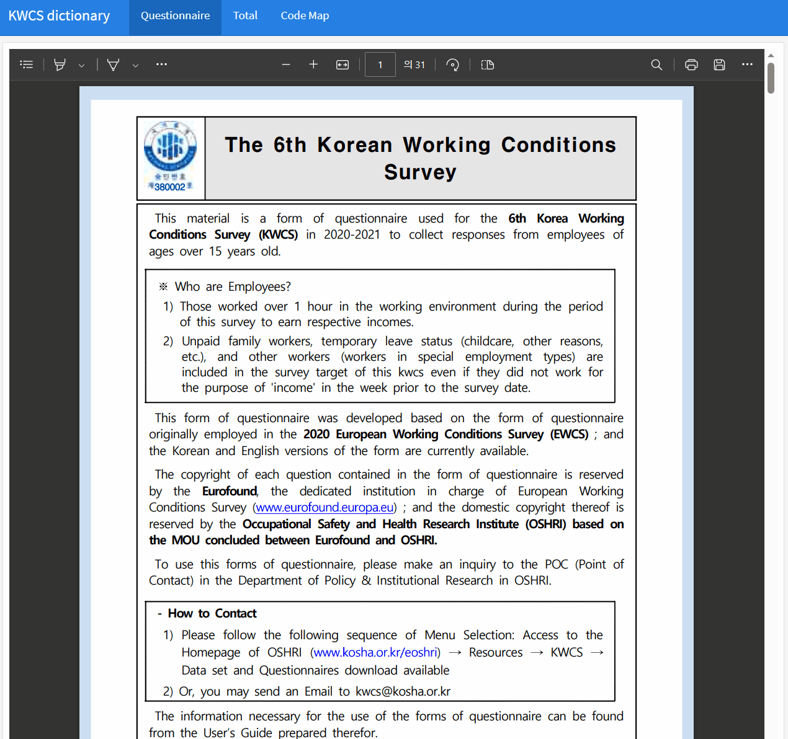
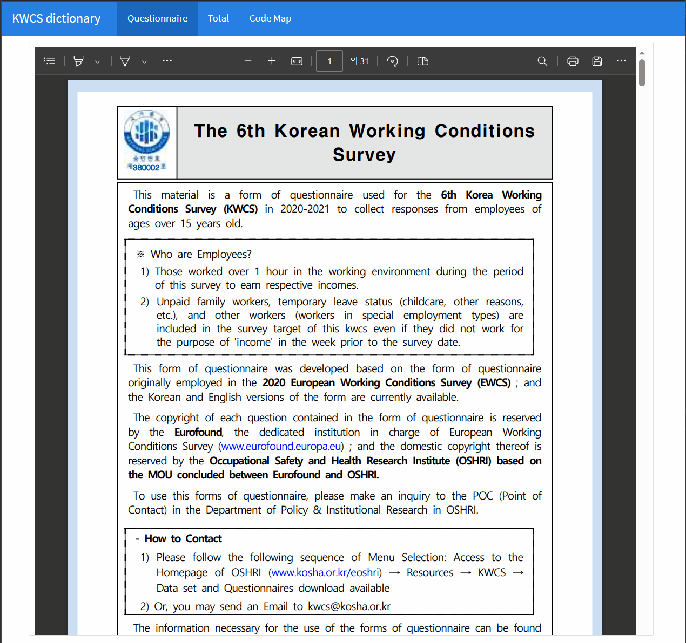

# Flexdashboard with DataTable

To create a data table with Flexdashboard, you can use the DT library, which provides an R interface to the JavaScript library DataTables. 



## download dictionary

You can download the dictionary of variables and values using the following R code:


```r
# Download dictionary of variables and values
url <- "https://github.com/jinhaslab/opendata/raw/8af2018ddd7f60b7323ce7bc69a58b0a9b70a07b/kwcs/pdf3.pdf"
download.file(url, "www/pdf3.pdf")

url2 <- "https://github.com/jinhaslab/opendata/raw/98779fcdb20ed1f3812a2793671c5d191c7a9703/kwcs/ques2.rds"
download.file(url2, "data/ques2.rds")
ques2 <- readRDS("data/ques2.rds")
```

The code downloads the ques2 data from the specified URL using the `download.file` function and saves it to a local file "data/ques2.rds". Then, it reads the data from the local file using the readRDS function and stores it in the ques2 object.


## first setting of flexdashboard

<script src="https://gist.github.com/jinhaslab/26e278d1c626a2f332035912b07eb3d1.js"></script>

 The code sets up the title of the dashboard to "KWCS dictionary" and specifies the output format as a Flexdashboard. It also loads the required packages, which include tidyverse, readxl, DT, and htmlwidgets.

In addition, it reads the ques2.rds data into the ques1 object and creates a new object ques_choice that contains the unique values of the type column from the ques1 data. This can be useful for filtering or grouping the data in later steps.

## button options


```r
btoption = list(
  list(
    extend = "excel",
    text = "current page (download)",
    filename = "data",
    exportOptions = list(modifier = list(page = "current"))
  ),
  list(
    extend = "excel",
    text = "total page (download)",
    filename = "data",
    exportOptions = list(modifier = list(page = "all"))
  )
)
```


The code creates a list btoption that defines two export options for the data table. The first option allows the user to download the current page of the data table as an Excel file, and the second option allows the user to download the entire data table as an Excel file.

## Data Table height and window height

<script src="https://gist.github.com/jinhaslab/28524db6e7dd4935d93c42b581a737fa.js"></script>


The code  is a JavaScript function that calculates the height of an element as a percentage of the window height. The function takes a single argument percentage, which is the percentage of the window height to use as the height of the element.

For example, if you want an element to be 60% of the window height, you would call getRelativeHeight(0.6). The function would then return the height of the element in pixels as a string, such as "720px".

This function can be useful when you want to create elements with dynamic height based on the size of the window, for example, when creating a dashboard with Flexdashboard. 


## create data table


```r
DT::datatable(
  ques2, 
  extensions = 'Buttons',
  filter = 'top', 
  options = list(
    searching = TRUE, 
    ordering = TRUE, 
    scrollx = TRUE, 
    dom = "Blfrtip",
    buttons = btoption
  )
)
```

```{=html}
<div class="datatables html-widget html-fill-item-overflow-hidden html-fill-item" id="htmlwidget-fd7a9dc1f62d97a09074" style="width:100%;height:auto;"></div>
<script type="application/json" data-for="htmlwidget-fd7a9dc1f62d97a09074">{"x":{"filter":"top","vertical":false,"filterHTML":"<tr>\n  <td><\/td>\n  <td data-type=\"character\" style=\"vertical-align: top;\">\n    <div class=\"form-group has-feedback\" style=\"margin-bottom: auto;\">\n      <input type=\"search\" placeholder=\"All\" class=\"form-control\" style=\"width: 100%;\"/>\n      <span class=\"glyphicon glyphicon-remove-circle form-control-feedback\"><\/span>\n    <\/div>\n  <\/td>\n  <td data-type=\"character\" style=\"vertical-align: top;\">\n    <div class=\"form-group has-feedback\" style=\"margin-bottom: auto;\">\n      <input type=\"search\" placeholder=\"All\" class=\"form-control\" style=\"width: 100%;\"/>\n      <span class=\"glyphicon glyphicon-remove-circle form-control-feedback\"><\/span>\n    <\/div>\n  <\/td>\n  <td data-type=\"character\" style=\"vertical-align: top;\">\n    <div class=\"form-group has-feedback\" style=\"margin-bottom: auto;\">\n      <input type=\"search\" placeholder=\"All\" class=\"form-control\" style=\"width: 100%;\"/>\n      <span class=\"glyphicon glyphicon-remove-circle form-control-feedback\"><\/span>\n    <\/div>\n  <\/td>\n  <td data-type=\"character\" style=\"vertical-align: top;\">\n    <div class=\"form-group has-feedback\" style=\"margin-bottom: auto;\">\n      <input type=\"search\" placeholder=\"All\" class=\"form-control\" style=\"width: 100%;\"/>\n      <span class=\"glyphicon glyphicon-remove-circle form-control-feedback\"><\/span>\n    <\/div>\n  <\/td>\n  <td data-type=\"character\" style=\"vertical-align: top;\">\n    <div class=\"form-group has-feedback\" style=\"margin-bottom: auto;\">\n      <input type=\"search\" placeholder=\"All\" class=\"form-control\" style=\"width: 100%;\"/>\n      <span class=\"glyphicon glyphicon-remove-circle form-control-feedback\"><\/span>\n    <\/div>\n  <\/td>\n  <td data-type=\"character\" style=\"vertical-align: top;\">\n    <div class=\"form-group has-feedback\" style=\"margin-bottom: auto;\">\n      <input type=\"search\" placeholder=\"All\" class=\"form-control\" style=\"width: 100%;\"/>\n      <span class=\"glyphicon glyphicon-remove-circle form-control-feedback\"><\/span>\n    <\/div>\n  <\/td>\n  <td data-type=\"character\" style=\"vertical-align: top;\">\n    <div class=\"form-group has-feedback\" style=\"margin-bottom: auto;\">\n      <input type=\"search\" placeholder=\"All\" class=\"form-control\" style=\"width: 100%;\"/>\n      <span class=\"glyphicon glyphicon-remove-circle form-control-feedback\"><\/span>\n    <\/div>\n  <\/td>\n  <td data-type=\"character\" style=\"vertical-align: top;\">\n    <div class=\"form-group has-feedback\" style=\"margin-bottom: auto;\">\n      <input type=\"search\" placeholder=\"All\" class=\"form-control\" style=\"width: 100%;\"/>\n      <span class=\"glyphicon glyphicon-remove-circle form-control-feedback\"><\/span>\n    <\/div>\n  <\/td>\n  <td data-type=\"character\" style=\"vertical-align: top;\">\n    <div class=\"form-group has-feedback\" style=\"margin-bottom: auto;\">\n      <input type=\"search\" placeholder=\"All\" class=\"form-control\" style=\"width: 100%;\"/>\n      <span class=\"glyphicon glyphicon-remove-circle form-control-feedback\"><\/span>\n    <\/div>\n  <\/td>\n  <td data-type=\"character\" style=\"vertical-align: top;\">\n    <div class=\"form-group has-feedback\" style=\"margin-bottom: auto;\">\n      <input type=\"search\" placeholder=\"All\" class=\"form-control\" style=\"width: 100%;\"/>\n      <span class=\"glyphicon glyphicon-remove-circle form-control-feedback\"><\/span>\n    <\/div>\n  <\/td>\n  <td data-type=\"character\" style=\"vertical-align: top;\">\n    <div class=\"form-group has-feedback\" style=\"margin-bottom: auto;\">\n      <input type=\"search\" placeholder=\"All\" class=\"form-control\" style=\"width: 100%;\"/>\n      <span class=\"glyphicon glyphicon-remove-circle form-control-feedback\"><\/span>\n    <\/div>\n  <\/td>\n<\/tr>","extensions":["Buttons"],"data":[["1","2","3","4","5","6","7","8","9","10","11","12","13","14","15","16","17","18","19","20","21","22","23","24","25","26","27","28","29","30","31","32","33","34","35","36","37","38","39","40","41","42","43","44","45","46","47","48","49","50","51","52","53","54","55","56","57","58","59","60","61","62","63","64","65","66","67","68","69","70","71","72","73","74","75","76","77","78","79","80","81","82","83","84","85","86","87","88","89","90","91","92","93","94","95","96","97","98","99","100","101","102","103","104","105","106","107","108","109","110","111","112","113","114","115","116","117","118","119","120","121","122","123","124","125","126","127","128","129","130","131","132","133","134","135","136","137","138","139","140","141","142","143","144","145","146","147","148","149","150","151","152","153","154","155","156","157","158","159","160","161","162","163","164","165","166","167","168","169","170","171","172","173","174","175","176","177","178","179","180","181","182","183","184","185","186","187","188","189","190","191","192","193","194","195","196","197","198","199","200","201","202","203","204","205","206","207","208","209","210","211","212","213","214","215","216","217","218","219","220","221","222","223","224","225","226","227","228","229","230","231","232","233","234","235","236","237","238","239","240","241","242","243","244","245","246","247","248","249","250","251","252","253","254","255","256","257","258","259","260","261","262","263","264","265","266","267","268","269","270","271","272","273","274","275","276","277","278","279","280","281","282","283","284","285","286","287","288","289","290","291","292","293","294","295","296","297","298","299","300","301","302","303","304","305","306","307","308","309","310","311","312","313","314","315","316","317","318","319","320","321","322","323","324","325","326","327","328","329","330","331","332","333","334","335","336","337","338","339","340","341","342","343","344","345","346","347","348","349","350","351","352","353","354","355","356","357","358","359","360","361","362","363","364","365","366","367","368","369","370","371","372","373","374","375","376","377","378","379","380","381","382","383","384","385","386","387","388","389","390","391","392","393","394","395","396","397","398","399","400","401","402","403","404","405","406","407","408","409","410","411","412","413","414","415","416","417","418","419","420","421","422","423","424","425","426","427","428","429","430","431","432","433","434","435","436","437","438","439","440","441","442","443","444","445","446","447","448","449","450","451","452","453","454","455","456","457","458","459","460","461","462","463","464","465","466","467","468","469","470","471","472","473","474","475","476","477","478","479","480","481","482","483","484","485","486","487","488","489","490","491","492","493","494","495","496","497","498","499","500","501","502","503","504","505","506","507","508"],["base","base","base","base","base","base","base","base","base","base","base","base","base","base","base","base","base","base","base","base","base","employment_status","employment_status","employment_status","employment_status","employment_status","employment_status","employment_status","employment_status","employment_status","employment_status","employment_status","employment_status","employment_status","employment_status","employment_status","employment_status","employment_status","employment_status","employment_status","employment_status","employment_status","employment_status","employment_status","employment_status","employment_status","employment_status","employment_status","employment_status","employment_status","employment_status","employment_status","employment_status","employment_status","employment_status","employment_status","employment_status","employment_status","employment_status","employment_status","employment_status","employment_status","employment_status","employment_status","employment_status","employment_status","working_hours","working_hours","working_hours","working_hours","working_hours","working_hours","working_hours","working_hours","working_hours","working_hours","working_hours","working_hours","working_hours","working_hours","working_hours","working_hours","working_hours","working_hours","working_hours","working_hours","working_hours","working_hours","company_type","company_type","company_type","company_type","company_type","company_type","company_type","company_type","company_type","company_type","company_type","company_type","working_hours","working_hours","working_hours","working_condition","working_condition","working_condition","working_condition","working_condition","working_condition","working_condition","working_condition","working_condition","working_condition","working_condition","working_condition","working_condition","work_environment","work_environment","work_environment","work_environment","work_environment","work_environment","work_environment","work_environment","work_environment","work_environment","work_environment","work_environment","work_environment","work_environment","work_environment","work_environment","work_environment","work_environment","work_environment","work_environment","work_environment","work_environment","work_environment","work_environment","work_environment","work_environment","work_environment","work_environment","work_environment","etc","working_methods","working_methods","working_methods","working_methods","working_place","working_place","working_place","working_place","working_place","working_place","working_place","working_place","working_place","working_place","working_place","working_schedule","working_schedule","working_schedule","working_schedule","working_schedule","working_schedule","working_schedule","working_schedule","working_schedule","working_schedule","working_schedule","working_schedule","working_schedule","working_schedule","working_schedule","working_schedule","working_schedule","working_schedule","working_schedule","working_schedule","working_schedule","working_schedule","working_schedule","working_schedule","work_life_balance","work_life_balance","work_life_balance","work_life_balance","work_life_balance","work_life_balance","work_life_balance","work_life_balance","work_life_balance","work_authority","work_authority","work_authority","work_authority","work_authority","work_authority","work_authority","work_authority","work_authority","work_authority","work_authority","work_authority","work_authority","work_authority","work_authority","work_authority","work_authority","work_authority","work_authority","work_authority","work_authority","work_authority","work_authority","work_authority","work_authority","work_authority","work_authority","work_authority","work_authority","work_authority","work_authority","work_authority","work_authority","work_authority","work_authority","organizational_culture","organizational_culture","organizational_culture","organizational_culture","organizational_culture","organizational_culture","organizational_culture","organizational_culture","organizational_culture","organizational_culture","organizational_culture","organizational_culture","organizational_culture","organizational_culture","organizational_culture","organizational_culture","organizational_culture","organizational_culture","organizational_culture","organizational_culture","organizational_culture","organizational_culture","organizational_culture","organizational_culture","organizational_culture","organizational_culture","organizational_culture","organizational_culture","organizational_culture","organizational_culture","organizational_culture","organizational_culture","organizational_culture","organizational_culture","organizational_culture","organizational_culture","organizational_culture","organizational_culture","organizational_culture","organizational_culture","organizational_culture","organizational_culture","organizational_culture","organizational_culture","organizational_culture","organizational_culture","job_training","job_training","job_training","job_training","job_training","job_training","job_training","job_training","job_training","job_training","job_training","job_training","organizational_culture","organizational_culture","organizational_culture","organizational_culture","organizational_culture","organizational_culture","organizational_culture","organizational_culture","committee","committee","committee","committee","committee","committee","committee","committee","committee","committee","committee","violence","violence","violence","violence","violence","violence","violence","violence","violence","violence","violence","health","health","health","health","health","health","health","health","health","health","health","health","health","health","health","health","health","health","health","health","health","health","health","health","health","health","health","health","health","health","health","health","violence","violence","violence","violence","violence","violence","violence","violence","violence","violence","violence","violence","violence","violence","violence","violence","violence","violence","violence","violence","violence","absence","absence","absence","absence","absence","absence","absence","absence","absence","absence","health","health","health","health","health","health","absence","absence","absence","absence","health","health","health","health","health","job_stress","job_stress","job_stress","job_stress","job_stress","job_stress","job_stress","job_stress","job_stress","job_stress","job_stress","job_stress","job_stress","job_stress","job_stress","job_stress","job_stress","job_stress","job_stress","job_stress","job_stress","job_stress","job_stress","job_stress","job_stress","job_stress","job_stress","job_stress","job_stress","working_expectance","working_expectance","working_expectance","working_expectance","working_expectance","working_expectance","working_expectance","life_activity","life_activity","life_activity","life_activity","life_activity","life_activity","life_activity","life_activity","life_activity","life_activity","life_activity","life_activity","life_activity","life_activity","life_activity","life_activity","life_activity","life_activity","life_activity","life_activity","life_activity","life_activity","life_activity","life_activity","life_activity","life_activity","life_activity","life_activity","life_activity","life_activity","life_activity","life_activity","life_activity","health","health","health","health","health","health","health","health","health","income","working_hours","working_hours","income","income","income","income","income","income","income","income","income","income","income","income","income","income","income","income","income","income","income","income","income","income","income","income","income","income","income","income","income","income","income","base"],["area","WT","hh_num","hh_num_1","hh_gender","hh_year","hh_estat","hh_elig","hh_mon","hh_target","hm_gender","hm_year","hm_rel","hm_estat","hm_elig","hm_mon","hm_target","hm_rel_t","target","country","country_etc","job1","job2","job3","job3_etc","job4","IND2","OCC2","income_peri","edu_endage","emp_type","selfemp_cate","emp_type_before","emp_type_before_etc","emp_stat","emp_con_term","emp_con_period","emp_con_period_y","emp_con_period_m","emp_con_period_77","emp_con_period_88","emp_con_period_99","emp_con_period_c","emp_con_renew","emp_noncon","emp_keep","emp_keep2","emp_keep2_etc","emp_expect","emp_expect_mon","emp_expect2","emp_expect2_etc","emp_fptime","emp_fptime1","emp_fptime2","emp_fptime3","emp_fptime4","emp_wage","emp_stat_sp","emp_place","selfemp_re1","selfemp_re2","selfemp_re3","selfemp_re4","selfemp_re5","selfemp_be","wtime_con1","wtime_con2","wtime_con2_day","wtime_con2_week","wtime_con2_month","wtime_con3","wday","wday_week","wday_month","wtime","wtime_week","wtime_month","wtime2","wtime2_week","wtime2_month","ctime","ctime_777","ctime_888","ctime_999","ptime","ptime_week","ptime_month","wsector","wsector_etc","comp_subcon","comp_size1","comp_size2","comp_size3","comp_size4","comp_female","comp_sjob","comp_emp","comp_emp_8888888","comp_emp_9999999","wduration","wduration_y","wduration_m","ch_wc1","ch_wc2","ch_wc3","ch_wc4","ch_downsizing","ch_tech","ch_restruct","ch_ic","ch_me","ch_ps","ch_ic_a","ch_me_a","ch_ps_a","hazard_phy1","hazard_phy2","hazard_phy3","hazard_phy4","hazard_phy5","hazard_phy6","hazard_phy7","hazard_phy8","hazard_phy9","hazard_phy10","hazard_phy11","hazard_erg1","hazard_erg2","hazard_erg3","hazard_erg4","hazard_erg5","hazard_erg6","hazard_psy1","hazard_psy2","hazard_psy3","hazard_etc1","hazard_etc2","hazard_etc3","hazard_etc4","hazard_etc5","hazard_etc6","hazard_etc7","proequip1","proequip2","safeinform","useequip1","useequip2","useequip3","visit_cust","wplace_main","wplace1","wplace2","wplace3","wplace6","wplace4","wplace7","wplace5","wplace5_etc","wplace_sl","wpalce_ch","wtime_night_a","wtime_night2_a","wtime_sun_a","wtime_sat_a","wtime_long_a","wtime_night","wtime_night2","wtime_sat","wtime_sun","wtime_long","wtime_resilience","wtime_length1","wtime_length2","wtime_length3","wtime_length4","wtime_length5","wtime_length6","wshift","wshift_etc","wcomback","wtime_arr1","wtime_arr2","wtime_arr3","wtime_arr_etc","wbalance","wwa1","wwa2","wwa3","wwa4","wwa5","wtime_ftwork","wtime_ftcomtool","wtime_private","winten1_1","winten1_2","winten2_1","winten2_2","winten3_1","winten3_2","winten3_3","winten3_4","winten3_5","winten_c","winterrupt1","winterrupt2","condim1","condim2","condim3","condim4","condim5","condim6","decla1","decla2","decla3","winflu1","winflu2","winflu3","ass_cust1","ass_cust2","alter_task1","alter_task2","task_division1","task_division2","wteam1","wteam2","wteam3_1","wteam3_2","wteam3_3","wsituation1","wsituation2","wsituation3","wsituation4","wsituation5","wsituation6","wsituation7","wsituation8","wsituation9","wsituation10","wsituation11","wsituation12","wsituation13","wsituation14","wsituation15","wsituation16","wsituation17","wsituation18","wsituation19","wsituation20","wsituation21","wsituation22","wsituation23","wsituation24","wsituation25","wsituation26","emo_manual","werror1","werror2","werror3","werror4","werror5","suggest1","suggest2","suggest1_1","suggest2_1","boss_gender","manaqual1","manaqual2","manaqual3","manaqual4","manaqual5","manaqual6","manaqual7","manaqual8","manaqual9","skillmat","tra1","tra2","tra3","tra4","tra4_etc","tra1_1","tra2_1","tra_ass2","tra_ass3","tra_ass1","tra_ask","comp_ass7","comp_ass8","comp_ass1","comp_ass2","comp_ass3","comp_ass4","comp_ass5","comp_ass6","comp_com1","comp_com2","comp_com3","comp_com4","comp_com5","comp_com0","comp_com6","comp_com7","comp_com8","comp_com9","emp_rep","disc1","disc2","disc3","disc4","disc5","disc6","disc7","disc8","disc9","disc10","disc11","heal_risk","heal_aff","heal_cond","heal_illhe","heal_lim1","heal_lim2","heal_lim3","heal_lim4","heal_prob","heal_prob1 / heal_prob1_1","heal_prob2 / heal_prob2_1","heal_prob3 / heal_prob3_1","heal_prob4 / heal_prob4_1","heal_prob5 / heal_prob5_1","heal_prob6 / heal_prob6_1","heal_prob7 / heal_prob7_1","heal_prob8 / heal_prob8_1","heal_prob9 / heal_prob9_1","heal_prob10","heal_prob11","heal_prob12","heal_prob13 / heal_prob13_1","heal_prob14","heal_prob15 / heal_prob15_1","heal_prob16","heal_prob17","heal_prob18","heal_prob19","sleep1","sleep2","sleep3","sleep4","asb1","asb2","asb3","asb4","asb1_1","asb2_1","asb3_1","asb4_1","asb5","asb6","asb7","asb5_1","asb6_1","asb7_1","asb5_1_1","asb5_1_2","abs5_1_1","abs5_1_2","heal_cure","abs_re1","abs_re2","abs_re3","heal_abs1","heal_abs1_888","heal_abs1_999","heal_abs2","heal_abs2_888","heal_abs2_999","heal_abs3","heal_abs3_888","heal_abs3_999","heal_hbp1","heal_hbp2","heal_hbp3","heal_bmi1","heal_bmi2","heal_bmi3","heal_wsick1","heal_wsick2","heal_wsick2_888","heal_wsick2_999","who1","who2","who3","who4","who5","satisfaction","wstat1","wstat2","wstat3","wstat4","wstat5","wstat6","wstat7","wstat8","wstat9","wstat10","wstat11","weng1","weng2","weng3","weng4","weng5","weng6","weng7","selfemp_sw1","selfemp_sw2","selfemp_sw3","selfemp_sw4","selfemp_sw5","imte1","imte2","imte3","imte4","imte5","job_c1","job_c1_666","job_c1_888","job_c1_999","job_c2","job_c3","job_c4","woutside1","woutside2","woutside3","woutside4","woutside5","woutside6","woutside7","woutside8","woutside1_1","woutside1_2","woutside1_88","woutside1_99","woutside2_1","woutside2_2","woutside2_88","woutside2_99","woutside3_1","woutside3_2","woutside3_88","woutside3_99","woutside4_1","woutside4_2","woutside4_88","woutside4_99","woutside5_1","woutside5_2","woutside5_88","woutside5_99","woutside6_1","woutside6_2","woutside7_1","woutside7_2","woutside8_1","heal_smo1","heal_smo2","heal_smo3","heal_smo4","heal_smo5","heal_smo6","heal_drk1","heal_drk2","heal_drk3","income_con","wtime_sp","wtime_sp2","income_bal","income_pos1","income_pos2","income_pos3","income_pos4","income_pos5","income_pos6","income_pos7","income_pos8","income_pos9","income_pos10","income_pos11","income_pos12","income_pos13","income_pos14","income_pos15","income_pos16","income_pred","income_client","earn_bus1","earn_bus2","earn_bus3","earn_bus4","earn_bus4_etc","earn_bus5","earn_bus6","earning1","earning1_8888","earning1_9999","earning2","earning_total","edu"],["region",null,"hh=household\r\nhow many people live in this househlod?",null,"what gender of his/her is?","how old is he/she?","What is the state of economic activity?","final respondent",null,null,"household member's gender","What is the year of birth of this household member?","The relationship between the household member and the householder.","What is this household member's the state of economic activity?",null,null,null,"hb=household member\r\nwhat is this person's relationship to you?",null,"Were you born in (this country)?",null,"Do you have one, or more than one job or business?","Aside from your main job, are these other jobs or businesses regular or occasional work?","What is your main reason for having more than one job?",null,null,"industry",null,null,"regular education completion age","employment type","employment type in self-employed","Immediately before this job, in your main activity were you?",null,"employment status","When you got employed, was the exact term of employment set?","How long is the period of your employment contract?",null,null,null,null,null,"emp_con_period category","Is the current contract of the job you worked on last week been repeated or renewed?","If you got a job, does it need you take a few days or weeks?","If your company been shut down or under adjustment of employment, do you think you will be able to keep the job?","Why did you answer “Yes”?",null,"How much longer do you expect to be able to work in your last week's job?",null,"Why did you answer \"No\"?",null,"What type of your working hours is? Full time/ part time",null,null,"full time, part time",null,"Did you received wages from the workplace, dispatch company, or service company?","Does your income correspond to how many clients you meet and you provide prizes or services (performance based earning system)?\r\n[Workers in special employment types]","Where did you work last week?","self-employed regarding questions",null,null,null,null,"When you became self-employed, was it mainly through your own personal preference or because you had no better alternatives for work?","contract working time",null,null,null,null,null,"working day",null,null,"working time",null,null,null,null,null,"commute time\r\nIn total, how many minutes per day do you usually spend travelling from home to work and back?",null,null,null,"preferred time\r\nProvided that you could make a free choice regarding your working hours and taking into account the need to earn a living: how many hours per week would you prefer to work at present?",null,null,"work sector",null,"company subcontractor","company size",null,null,null,"Approximately how many of them are female?","At your place of work, are workers there with the same job title as you …? By same job title I mean workers who do the same or a similar job.","How many people work under your supervision, for whom pay increases, bonuses or promotion depend directly on you?",null,null,"work duration\r\nHow many years have you been in your company or organisation?","work duration year",null,"change in working conditions",null,null,null,"change the number of emplyees","change the processess or technologies","change the restruring or reorganization","changed the information and communication tools","changed methods of work","changed products or services",null,null,null,"physical hazards",null,null,null,null,null,null,null,null,null,null,"ergonomics hazards",null,null,null,null,null,"psychology hazards",null,null,null,null,null,null,null,null,null,"protective equipment",null,"provide health and safety related information","use equipment",null,null,"visiting customers, patients, clients or working at their premises or in their\r\nhome?",null,"work place",null,null,null,null,null,null,null,"workplace single location","workplace choose \r\nTo what extent are you able to choose where you work? This may include working from home or working in different sites outside your regular physical place of work.",null,null,null,null,null,"work at night",null,"work on Saturday","work on Sunday","work more than 10 hours a day","resilience","work time length",null,null,null,null,null,"shift work",null,"Since you started your main paid job, how often have you been requested to come into work at short notice?","working time arrangements set",null,null,null,"how do your working hours fit in with your family or social commitments outside work?","work worries/anxiety",null,null,null,null,"worked in your free time to meet work demands?","in your free time, how often have you used  communication tools for work?","arranging to take an hour or two off during working hours to take care of personal or family matters is... ?","work intensity",null,null,null,null,null,null,null,null,null,"interrupt a task",null,"congnitive dimension",null,null,null,null,null,"decision latitude",null,null,"influence what you do in your work?",null,null,"assessed by customer or suppliers",null,"alternating task",null,"the division of the tasks",null,"Q58 Do you work in a group or team that has common tasks and can plan its work?\r\nQ59 Is that always in the same team or group, or in several teams or groups?",null,null,null,null,"work situation",null,null,null,null,null,null,null,null,null,null,null,null,null,null,null,null,null,null,null,null,null,null,null,null,null,"emotional labor manual","work error",null,null,null,null,"suggestions to managers",null,null,null,"immediate boss a man or a woman?","management quality",null,null,null,null,null,null,null,null,"skills match","training",null,null,null,null,null,null,null,null,"training assessment","ask for training","company assessment",null,"company assessment",null,null,null,null,null,"compnay committee",null,null,null,null,null,"compnay committee",null,null,null,"employees represent","discrimination",null,null,null,null,null,null,null,null,null,null,"health or safety is at risk because of your work","work affect your health","health conditions","have any illness or health problem","limited because of a health problem",null,null,null,"have any of the following health problems",null,null,null,null,null,null,null,null,null,null,null,null,null,null,null,null,null,null,null,"sleep related problems",null,null,null,"adverse social behaviour_violence\r\nHarassment, bullying, violence, sexual harassment, threats, violence",null,null,null,null,null,null,null,null,null,null,null,null,null,null,null,null,null,"health cure","reason for absence",null,null,"absent from work due to sick leave or health-related leave?",null,null,null,null,null,null,null,null,"건강 고혈압 health high blood pressure","건강 고혈압 health high blood pressure","건강 고혈압 health high blood pressure","건강 비만 health bmi(body mass index)","건강 비만 health bmi(body mass index)","건강 비만 health bmi(body mass index)","did you work when you were sick?",null,null,null,"the who-5 well-being index",null,null,null,null,"working conditions satisfaction","current status of work",null,null,null,null,null,null,null,null,null,null,"직무열의job engagement",null,null,null,null,null,null,"self-employed status of work",null,null,null,null,"impact of technological progress on work",null,null,null,null,"job continuity\r\nUntil what age do you want to work",null,null,null,null,null,null,"activities outside work",null,null,null,null,null,null,null,null,null,null,null,null,null,null,null,null,null,null,null,null,null,null,null,null,null,null,null,null,null,null,null,null,"건강 흡연 health smoking","건강 흡연 health smoking","건강 흡연 health smoking","건강 흡연 health smoking","건강 흡연 health smoking","건강 흡연 health smoking","건강 음주 health drinking","건강 음주 health drinking","건강 음주 health drinking","income_contribute","spouse working hours","spouse desired working hours","incom_balance","income composition",null,null,null,null,null,null,null,null,null,null,null,null,null,null,null,"income predict","proportion of revenue from client","earnings from business include",null,null,null,null,null,null,"net monthly earning",null,null,null,null,"education"],["Regions","Standardized weights (reflecting post-stratification)","Number of household members","Number of surveyed household members out of total household members","Head of household gender","Household head's year of birth","Head of household economic activity status","Household head eligibility status","Household head's date of birth","Whether the household head was selected for the survey","Gender of household member","Household member's birth year","Household member's relationship to the head of household","Household member's economic activity status","Household member's eligibility status","Household member's date of birth","Whether the household member was selected for the survey","Household member's relationship to the final respondent","The final respondent","Place of birth","Place of birth Other","Number of jobs","Whether the side hustle is regular or not","Reasons for having a side hustle","Reasons for having a second job - other answers","Whether you have a second job","Industry Subcategory","Occupational classification","After graduation, how many years did you work for money?","Age of completion of formal education","Employment status","Self-employed, Business owner_Category of primary occupation","Occupational status at previous job","Occupational status at previous job - other answer","Wage earner Employment type","Term of employment","Length of employment contract","Length of employment contract (years)","Length of employment (months)","Employment period (less than 1 month)","Don't know/no response","Rejected","Term","Whether the contract is renewable","Type of work if not fixed term","Continuity of work at current company","Reasons for answering \"I can continue to work as long as I want","Reasons for answering \"I can continue to work as long as I want\" Other answers","How long do you expect to continue working","How long do you expect to be able to continue working - 1 year or less (months)","Reasons for answering `cannot continue to work as long as I want'","Reason for answering \"I can't continue to work as long as I want\" - other answer","Employee_Type of work hours","Full-time work Hours per week","Part-time Hours worked per week","Worked (part-time, full-time)","Desired work arrangement (only for 'part-time')","Employee_Wage payer","Employee_Whether earning income based on performance (insurance agent, tutor, etc.)","Employee_Location","Self-employed/business owner A. I can hire or fire employees as I please","Self-employed/business owner B. I receive a set amount of compensation on a weekly or monthly basis","Self-employed/business owner C. I hire employees","Self-Employed/Business Owner D. I have more than one client or customer","Self-Employed/Business Owner E. I can choose to take on new customers/clients","Self-employed_Reasons for choosing self-employment","Whether to set hours in an employment contract","Contractual hours of employment","Work hours set in employment contracts (per day)","Work hours set in employment contracts (weekly)","Hours set in the contract (per month)","Type of employment contract (if working hours are not set in the employment contract)","Number of workdays per week","Number of workdays per week (weekly)","Number of workdays per week (per month)","Hours per week","Hours per week (weekly)","Work hours per week (per month)","Part-time hours per week","Side hustle hours per week (weekly)","Secondary Hours per Week (Monthly)","Commute time","Commute time (0 minutes or N/A)","Commute time (don't know/no response)","Commute time (refused)","Desired hours per week","Desired hours per week - weekly","Desired hours per week - monthly","Type of current job (private/public/NGO)","Type of workplace (private/public/NGO) - other answer","Type of current workplace (identify principal/subcontractor relationship)","Number of workplaces (determine if there are multiple)","Size of workplace - if there is only one workplace","Size of workplace - if more than one workplace","If multiple worksites_Total number of workers","Percentage of women in the workplace","Gender distribution of employees in the same job","Number of subordinates","Number of subordinates (don't know/no response)","Number of subordinates (refused)","working duration",null,null,"A. Change in working conditions (change in hours worked in the past year)","B. Whether your working conditions have changed (change in income/earnings over the past year)","C. Whether your working conditions have changed (your discretion over your work in the past year)","D. Whether your working conditions have changed (your tasks and assignments in the past year)","Change in workplace size in the past 3 years","A. Whether your work environment has changed (introduction of new processes or technology in the past three years)","B. Changes in work environment (reorganization or restructuring of business, positions, organization, etc. in the past three years)","A. Changes introduced in the past three years (introduction of new information and communication devices or significant changes)","B. Changes introduced in the past three years (introduction of new work methods or significant changes)","C. Changes introduced in the last three years (introduction of new products or services or significant changes)","Impact of changes introduced in the last three years on the way we work (introduction of new information and communication devices or significant changes)","Impact of changes introduced in the last three years on the way we work (introduction of new ways of working or significant changes)","Impact of changes introduced in the last three years on the way you work (introduction of new products or services or significant changes)","A. Frequency of exposure to hazards1 (vibration from hand tools, machinery, etc.)","B. Frequency of exposure to the risk factor1 (loud noises that require you to raise your voice when speaking to others)","C. Hazard Exposure Frequency1 (Temperatures high enough to make you sweat, even when you are not working)","D. Risk Factor Exposure Frequency1 (Low temperatures regardless of whether you are indoors or outdoors)","E. Hazard exposure frequency1 (Inhalation of fumes, fumes (welding fumes or exhaust), and dusts (such as throat dust, mineral dust, etc.))","F. Hazard Exposure Frequency1 (Inhalation of vapors from organic solvents such as thinners)","G. Hazard exposure frequency1 (handling chemicals/materials or skin contact)","H. Hazard Exposure Frequency1 (Tobacco smoke from other people)","I. Hazard Exposure Frequency1 (Handling or direct contact with infectious materials such as waste, body fluids, and laboratory materials)","Hazard Exposure Frequency1 (Radiation, such as x-rays, radioactivity, welding, and laser beams)","Hazard Exposure Frequency 1 (Whole-body vibration transmitted to the body by vehicles such as forklifts and dump trucks)","A. Frequency of Risk Factor Exposure2 (Fatiguing or painful postures)","B. Risk Factor Exposure Frequency 2 (Lifting or moving people)","C. Risk factor exposure frequency2 (pulling, pushing, or moving heavy objects)","D. Risk Factor Exposure Frequency 2 (Constant Standing)","E. Hazard Exposure Frequency 2 (Sitting)","F. Risk Factor Exposure Frequency 2 (Repetitive Hand or Arm Movements)","G. Hazard Exposure Frequency 2 (Direct contact with people who are not coworkers, such as customers, passengers, students, or patients)","H. Risk factor exposure frequency2 (dealing with angry customers, patients, or students)","I. Exposure to Risk Factors2 (Being in emotionally disturbing situations)","I. Frequency of Exposure to Risk Factors2 (Work involves working with a computer, laptop, or smartphone)","J. Frequency of Risk Factor Exposure2 (The extent to which your job involves using the Internet and email)","Frequency of exposure to risk factors2 (Telecommuting using a computer)","Frequency of exposure to risk factors2 (Not telecommuting, but working from home)","Risk Factor Exposure Frequency2 (Worked at a client's office, on the street, etc. rather than in your own building or at home)","Frequency of exposure to hazards2 (Wearing personal protective equipment or PPE)","Exposure to hazards2 (I work in my company's building)","Whether there are times when you need to wear personal protective equipment","Whether personal protective equipment is worn","The extent to which information about health and safety is provided","A. How you work (using a computer, laptop, tablet, or smartphone to work)","B. The extent to which work methods are used (working with other devices (equipment, machinery) to access the Internet or operate machinery)","C. How you work (performing work that is assigned to you in an automated manner without human intervention)","Whether you perform work that involves customer visits","Primary place of work (last 12 months)","A. Whether you worked at your employer's place of business or at your place of business (office, factory, store, school, etc.)","B. Whether you worked at a location designated by your employer or desired by the customer (customer's office, customer's home, construction site, etc.)","C. Worked in a vehicle, such as a car or truck (including driving your own vehicle, public transportation, as well as driving a professional vehicle, such as taxiing or driving a truck)","D. Whether you have worked outdoors (construction sites, orchards, etc.)","D. Have you ever worked in your own home","F. Experience working in public places","E. Other","E. Other-other answer","Worked in one location","Whether you can choose where you work","Whether you work nights","Whether you work evenings","Whether you work on Sundays","Work Saturdays","Worked more than 10 hours in a day","Number of night shifts (1 month)","Number of Evening Shifts (1 month)","Number of Saturdays worked (1 month)","Number of Sunday shifts (1 month)","Number of long hours worked (1 month)","Presence or absence of breaks of less than 11 hours","A. Shift type (every workday is the same length)","B. Work schedule (same number of work days each week)","C. Work schedule (same length of working hours each week)","D. Working arrangements (fixed time of arrival and departure)","E. Work schedule (I work in shifts)","E. On-call (I'm on call when I'm called to work)","Shift type","Shift Type-Other","Frequency of requests to return to work at short notice","Flexibility of working hours","Whether changes in working hours occur","When will I be notified of a shift change?","When I am notified of a change in hours - other answers","How well do your work hours fit in with your personal life?","A. I continue to worry about work even when I am not working","B. You are too tired after work to do the chores you need to do.","C. Work prevents you from devoting as much time to your family as you would like to","D. Chores make it hard to focus on work","E. You don't have enough time for work because of your chores","Frequency of personal free time allocated to work time","Frequency of use of work devices outside of work","Possibility of conducting personal business during working hours","A. Repetitive tasks (1 minute (with or without short repetitive tasks))","B. Repetitive tasks (10 minutes (with or without short repetitive tasks))","A. Including work situations (working at a very fast pace)","B. Work situation included or not (working to a strict deadline)","A. Determinants of work pace (work done by coworkers)","B. Work pace determinants (direct needs of people, such as customers, passengers, students, and patients)","C. Work rate determinants (quantified production goals or performance targets)","D. Work rate determinants (automated line speed or product movement speed)","E. Work rate determinants (direct management and supervision by supervisors)","Work Pace Determinants","Have you ever been interrupted by unexpected work?","Impact of work stoppages on work","A. Work characteristics (I have to meet strict quality standards)","B. Work characteristics (I have to evaluate the quality of my work)","C. Work characteristics (I have to solve unexpected problems on my own)","D. Work characteristics (monotonous)","E. Work characteristics (complex)","F. Work characteristics (learning new things)","A. Ability to choose tasks (sequence of tasks)","B. Possibility to choose tasks (work methods)","C. Possibility of task selection (pace or rate of work)","A. Influence of work (boss or manager)","A. Influence of work (customers or clients)","A. How much your work is influenced by (computerized systems)","Formal evaluation from customers/clients","Use of formal evaluations from customers/clients","Whether rotational work is included","Homogeneity of tasks in rotational work","A. Work allocation decision maker (supervisor/manager)","B. Who determines the work assignment (the people doing the rotation)","Working as part of a team","Type of team organization","A. Autonomy of members (team members distribute work)","B. Autonomous (team members elect a team leader)","C. Autonomous (team members decide the work schedule)","A. Work situation (coworkers help and support me)","B. Work situation (My boss is helpful and supportive)","C. Work situation (I am asked for my opinion before work goals are determined)","D. Work situation (I am involved in improving the structure of my department, organization, or work procedures)","E. Work situation (My opinion is taken into account when choosing people to work with)","F. Work situation (I can take breaks when I want to)","G. Work situation (I have enough time to complete my work)","H. Work situation (I feel like I did a good job when I do my work)","I. Work situation (I can reflect my thoughts when I do my work)","J. Work situation (I feel like I am doing something useful)","K. Work situation (I am treated fairly at work)","L. Work situation (I feel stressed at work)","M. Work situation (I have influence over important decisions at work)","N. Work situation (I have to hide my feelings and do my job)","O. Work situation (I know what is expected of me at work)","O. Work situation (My work is not in line with my personal values)","Work situation (I am emotionally involved in my work)","I can get outside help if I need it","I have the freedom to decide when to take vacation time","I have opportunities to use my skills to the best of my ability","I use my head a lot or think my job is a headache","Experience in the past year - Talking to your boss about your performance","Experience in the past year - Suggestions for changes in work organization or work environment","Experience in the past year-Conversations with supervisor about work problems","Experience in the past year-Conversations with worker representatives about work problems","Experience in the past year - Regular personal performance evaluations","Do you have a manual (norm) on expressing emotions?","A. Ripple effect of work mistakes (hurting oneself)","B. Repercussions of work mistakes (injuring others)","C. Repercussions of mistakes (delaying work)","D. Repercussions of making a mistake (causing stress to others)","E. Repercussions of a mistake (causes financial damage to the company)","A. Do I make work and quality improvement suggestions to my manager (ways to improve work efficiency)?","B. Whether to make work and quality improvement suggestions to management (improve the quality of work, products, or services)","A. Suggestions for work and quality improvements are taken into account (measures to improve work efficiency)","B. Whether work and quality improvement suggestions are taken into account (to improve the quality of work, products, or services)","Gender of immediate supervisor","A. My supervisor's qualities and attitude (He/she respects me as a person)","C. My supervisor's qualities and attitudes (helps employees work well together)","D. My supervisor's qualities and attitudes (help me get things done)","E. The quality and attitude of my supervisor (gives me helpful feedback on my work)","F. Qualities and attitudes of your supervisor (encourages and helps you develop)","Qualities and attitudes of your supervisor (resolves conflicts well)","Your supervisor's qualities and attitudes (plans and organizes work well)","Qualities and attitudes of my supervisor (encourages me to participate in important decisions)","My supervisor's qualities and attitudes (praises and recognizes me when I do a good job)","Assessing Your Skills","A. Education and training experience (education (training) provided or paid for by employer)","B. Education and training experience (education (training) that you pay for yourself)","C. Training experience (on-the-job training/education)","D. Education and Training Experience (Other Training)","D. Education and training experience (other training)_ Other response","Number of days of education (training) provided or paid for by employer","Number of days of training you paid for yourself","Education and Training Evaluation (Education and training has helped me improve the way I do my job)","Education and Training Evaluation (I think I have more job security because of my training)","Education (training) evaluation (I think I have better prospects for future employment)","Training needs for the company","A. Formal work evaluation in the past 12 months, whether the representative raised any work-related issues (whether you have experienced an evaluation of your work performance)","B. Formal performance appraisal in the past 12 months, whether you have raised work-related issues with your representative (whether you have ever raised work-related issues with your representative)","A. Workplace evaluation (employees are recognized and praised when they do a good job)","B. Workplace assessment (management believes employees do a good job)","C. Workplace (Conflicts are handled in a fair manner)","D. Workplace Assessment (Work is distributed fairly)","E. Workplace Rating (There is good cooperation between me and my coworkers)","F. Workplace Assessment (Employees generally trust management)","A. Existence of a labor union or similar committee","B. Does the company have a safety and health representative or safety and health committee?","C. Whether there are regular meetings where employees can express their opinions on what is happening at the company","D. There is a point of contact to address safety concerns","Whether management seeks input from workers","Existence of worker activities (unions, works councils, etc.) to represent workers' views in the workplace","A. Organized or not (trade union)","B. Organized or unorganized (works council/workplace consultation)","C. Organized or not (other)","Union membership","Experience with formal representation in the workplace","A. Experience of discrimination (age discrimination)","B. Experience of discrimination (discrimination based on ethnic origin)","C. Experience of discrimination (discrimination based on national origin)","D. Experience of discrimination (discrimination based on race or color)","D. Experience of Discrimination (Sex Discrimination)","E. Experience of discrimination (discrimination due to religion)","F. Experience of discrimination (discrimination due to disability)","G. Experience of discrimination (discrimination due to sexual orientation, such as homosexuality)","H. Experience of discrimination (discrimination based on education)","I. Experience of discrimination (discrimination based on national origin)","J. Experience of discrimination (discrimination based on type of employment)","Whether your job poses a threat to your health or safety","Whether your job affects your health","General health condition","Illness or health problem that has lasted or is likely to last more than six months","Limitations on daily activities due to an illness or health problem","Limitations on daily activities due to an illness or health problem that have lasted more than six months","Whether the job or work environment is accommodating because of the illness or health condition","Job or work environment requires accommodation due to illness or health condition","Health problems in the past year","A. Whether the health problem is work-related (back pain)","B. Whether the health problem is related to work (upper extremity muscle pain, such as shoulder, neck, arm, elbow, wrist, or hand)","C. Whether the health problem is work-related (lower extremity muscle pain, such as hip, leg, knee, or foot pain)","D. Health problems and whether they are work-related (headaches, eye strain)","E. Health problems (anxiety)","F. Whether the health problem is work-related (generalized fatigue)","G. Whether the health problem is work-related (other)","Whether your health problem is work-related (hearing problems)","Health Problems and Work Relatedness (Skin Problems)","Whether Your Health Problem Is Work Related (Stomach Pain)","Whether Your Health Problem Is Work Related (Shortness of Breath)","Whether a Health Problem is Work Related (Cardiovascular Disease)","Whether a Health Problem is Work Related (Disfigurement (Accidental Injury))","Whether your health problem is work-related (depression or anxiety disorder)","Health Problems (Depression)","Whether a health problem is work-related (insomnia or sleep disorder)","Whether a health problem is work-related (allergies)","Whether a health problem is work-related (stress)","Health Problems - Poor Vision","A. Sleep disorder (difficulty falling asleep)","B. Sleep disorder (waking up frequently during sleep)","C. Sleep disorder (feeling tired and exhausted after waking up)","Sleep disturbance (waking up feeling exhausted or extremely tired)","A. Something happened to you on the job1 (whether or not you were verbally abused)","B. On the job1 (whether you were victimized by unwanted sexual attention)","C. On the job1 (whether you were victimized by threats)","D. On the job1 (whether you were harmed by offensive behavior)","A. Subject of the incident (whether you were subjected to verbal abuse)","B. What happened to you in the course of your work (whether you were harmed by unwanted sexual attention)","C. The subject of what happened to you in the course of your work (whether you were harmed by threats)","D. Subject of what happened to you in the course of your employment (whether you were harmed by offensive behavior)","A. What happened to you in the course of your work2 (whether you experienced physical violence)","B. What happened to you in the course of your work2 (whether you experienced sexual harassment)","C. What happened to you in the course of your work2 (whether you were victimized by bullying/harassment)","A. Subject of what happened to you in the course of your work (whether you were victimized by physical violence)","B. What happened to you in the course of your work (whether you were victimized by sexual harassment)","C. Subject of what happened to them in the course of their work (whether they experienced bullying/harassment)","A. Subject of what happened to me in the course of my work (whether or not I experienced physical violence)_Colleagues, supervisors, juniors","A. Subject of what happened to you in the course of your work (whether you experienced physical violence) _ Customers, suppliers, etc.","Experience in the past year - Physical assault by a coworker, supervisor, or subordinate","Experience in the past year - physical assault by customers, vendors, etc.","Have you been treated in a hospital for a health problem in the past year?","Time off work or absenteeism for education in the past year","Taken time off work for family matters in the past year","Missed work due to injury or illness in the past year","Number of days missed from work in the past year",null,null,"A. Days away from work (on-the-job accidents)",null,null,"B. Days away from work (health problems caused by work or health problems aggravated by work)",null,null,"High blood pressure - if determined","High blood pressure - when diagnosed","Hypertension - current condition","Obesity - Determined","Obesity - when diagnosed","Obesity - Current","Experience working while sick","Number of days worked while sick","Number of days worked while sick (don't know/no response)","Number of days worked while sick (refused)","A. How you feel in the past 2 weeks (I have fun and feel good)","B. How I feel in the past 2 weeks (I feel calm and relaxed)","C. How I feel in the past 2 weeks (I feel active and energetic)","D. How I feel in the past 2 weeks (I wake up feeling refreshed and well-rested)","E. How I feel in the last 2 weeks (My daily life is full of interesting things)","Workplace satisfaction","A. Considering the effort and accomplishments of my job, I am adequately compensated.","B. My job has good prospects","C. I get the recognition I deserve for my work","D. I feel that I am in strong competition with others for my job","E. The organization I work for motivates me to do my best work","F. I may lose my current job in the next six months","G. If I were to leave my current job or become unemployed, I would be able to easily find a job with similar pay.","I feel very comfortable in the organization","I get along well with my coworkers overall","I get along better with my children because I am working","Attitudes toward work - I have opportunities to learn and grow at work","A. I feel energized at work","B. I am enthusiastic about my work","C. Time passes quickly when I am at work","D. I feel physically exhausted when I leave work","E. I feel exhausted by my work","E. I am skeptical about the importance of my work","F. I think I am good at my job","A. Questions for business owners or self-employed (whether they would not have financial worries if they were sick for a long time)","B. Business owner or self-employed questions (whether I enjoy running my own business)","C. Whether I feel overwhelmed by the responsibility of running my own business","D. Whether I make the most important decisions in running my business","C. Whether it is easy to find new customers","A. How worried am I about the impact of technological advances on my work in the future (if my voice is diminished)?","B. How worried I am about the impact of technological advances on my future work (difficult to utilize my skills and abilities)","C. How worried I am about the impact of technological advances on my future work (I'm earning less money)","D. Worry about the impact of technological advancements on my future work (being forced by my organization to do work I don't enjoy)","E. Worry about the impact of technological advances on my future work (working hours changing against my will)","Age at which you want to work","Age at which you want to work (as long as possible)","Age at which you want to work (don't know/no response)","Age at which you want to work (refused)","Job Persistence - Age 55 or younger","Job Persistence - 56 and Over","Job Continuation Outlook","A. How often do you work outside of the home (care for or educate children)","B. How often do you work outside the home (care for elderly or disabled family members)","C. Frequency of non-work activities (cooking and housework)","D. Frequency of non-work activities (sports, athletic/cultural activities at home, outside, leisure activities, etc.)","E. Frequency of non-work activities (volunteer or charity work)","Frequency of non-work activities (political/union activities)","Frequency of non-work activities (self-development such as education, training, etc.)","Frequency of non-work activities (gardening, home repair, etc.)","Average hours per day of participation in non-work activities A. Caring for or educating children (children, grandchildren, grandchildren, etc.) - hours","Average number of hours per day spent on non-work activities A. Caring for or educating children (children, grandchildren, grandchildren, etc.) - minutes","Average hours per day of participation in non-work activities A. Caring for or educating children (children, grandchildren, grandchildren, etc.) (don't know/no response)","Average hours per day participating in non-work activities A. Caring for or educating children (children, grandchildren, grandchildren, etc.) (Refused)","Average hours per day participating in non-work activities B. Caring for elderly or disabled family members - hours","Average hours per day of participation in non-work activities B. Caring for elderly or disabled family members - minutes","Average hours per day participating in non-work activities B. Caring for elderly or disabled family members (don't know/no response)","Average hours per day participating in non-work activities B. Caring for elderly or disabled family member (refused)","Average hours per day participating in non-work activities C. Cooking and housework - hours","Average daily participation in non-work activities C. Cooking and housework - minutes","Average hours per day participating in non-work activities C. Cooking and housework (don't know/refused)","Average hours per day participating in non-work activities C. Cooking and housework (refused)","Average hours per day of participation in non-work activities D. Sports, athletic/cultural activities outside the home, leisure activities, etc.-hours","Average daily participation in non-work activities D. Sports, athletic/cultural activities outside of home, leisure activities, etc.-minutes","Average hours per day of participation in non-work activities D. Sports, athletic/cultural activities outside of home, leisure activities, etc. (Don't know/no response)","Average hours per day participating in activities outside of work D. Sports, athletic/cultural activities outside of home, leisure activities, etc. (Refused)","Average hours per day of participation in non-work activities E. Volunteer or charitable activities - hours","Average daily participation in non-work activities E. Volunteer or charitable activities - minutes","Average hours per day of participation in non-work activities E. Volunteer or charitable activities (don't know/no response)","Average hours per day of participation in nonwork activities E. Volunteer or charitable activities (refused)","Average hours per day engaged in political/union activities - hours","Average hours of participation per day (political/union activities) - minutes","Average time spent per day on self-development (education, training, etc.) - hours","Average time spent per day on self-development (education, training, etc.) - minutes","Average number of hours per day (gardening, home improvement, etc.) - minutes","Total cigarettes smoked","Frequency of smoking","Average number of cigarettes smoked per day (cigarettes)","Number of days smoked in the past month","Number of cigarettes smoked in the past month","Designated no-smoking areas","Drinking frequency","Amount of alcohol consumed","Number of times you drink 1 bottle of shochu or 4 or more beers","Household income contribution","Spouse work hours","Desired spouse hours","Balance of income and expenses","A. Composition of earned income (fixed base salary)","B. Composition of earned income (piece rate and efficiency pay)","C. Composition of Earned Income (Overtime, Overtime Pay/Overtime Pay)","C. Composition of Earned Income (Overtime, Overtime Pay/Overtime Pay)","E. Composition of Earned Income (Holiday Pay/Overtime Pay)","F. Composition of Earned Income (Performance Pay Based on Individual Performance)","H. Composition of Earned Income (Performance Pay based on the overall performance of the company)","H. Composition of Earned Income (Periodic Bonuses)","I. Composition of Earned Income (Commissions, Tips)","J. Composition of earned income (other benefits (welfare benefits, pension store access, etc.))","B. Composition of Earned Income (Performance Pay)","F. Composition of Earned Income (Other Allowances)","G. Composition of Earned Income (Performance Pay Based on Team/Group/Department Performance)","I. Composition of Earned Income (Company Dividends)","J. Composition of Earned Income (Other Types of Benefits)","K. Composition of earned income (other)","Predictability of wage earners' future income","Contribution of customers to revenue","A. Composition of business revenue (business income)","B. Composition of business income (income based on the company's or business partner's performance)","C. Composition of business revenue (dividends from the company)","D. Composition of Business Revenue (Other)","D. Composition of business income (other) - Other answers","A. Profit sharing of income from the principal business (whether the company's performance fee is determined by a predetermined process)","B. Profit sharing of income from the main business (whether you receive a regular allowance)","Average Monthly Income_Customary","Average monthly income (don't know/no response)","Average monthly income (refused)","(Respondents who refused to answer EF10) Average monthly income_Objective","Median monthly income (binned) - overall combined","Education."],["X","X","○","X","○","○","○","○","X","X","X","○","○","○","X","X","X","○","X","○","X","X","X","X","X","○","○","○","○","○","○","X","○","X","○","○","○","X","X","X","X","X","X","X","○","○","○","X","X","X","○","X","○","X","X","○","○","○","○","○","X","X","X","X","X","X","X","X","X","X","X","X","○","X","X","○","X","X","○","X","X","○","X","X","X","○","X","X","○","X","○","X","X","○","X","X","○","○","X","X","○","X","X","○","○","X","X","X","○","○","X","X","X","X","X","X","○","○","○","○","○","○","○","○","○","○","○","○","○","○","○","X","○","○","○","X","○","○","○","○","○","○","○","○","○","○","X","X","X","○","○","X","X","X","X","X","X","X","X","X","X","X","X","X","X","X","○","○","○","○","○","X","○","○","○","○","○","○","○","X","X","○","○","X","X","○","X","X","X","X","X","○","X","○","○","○","○","○","○","○","○","○","○","X","○","○","○","○","○","○","○","○","○","○","○","X","X","X","X","X","○","○","○","○","○","X","○","○","○","○","○","○","○","○","○","○","○","○","○","X","○","○","○","○","○","○","○","○","○","○","X","X","X","X","X","○","○","○","○","○","○","X","X","X","X","○","○","X","○","○","○","○","X","X","X","○","○","○","○","○","X","X","X","○","○","○","○","○","○","X","X","X","X","X","X","X","X","X","X","○","○","○","○","○","○","X","○","X","○","○","○","○","○","○","○","○","○","○","○","○","X","X","X","X","X","○","○","○","○","○","X","○","○","○","○","○","○","○","○","○","X","○","○","○","X","X","X","X","X","○","○","○","X","○","○","○","X","○","○","○","○","○","○","X","X","X","X","○","○","○","○","○","X","X","X","X","X","X","X","X","X","X","X","X","X","X","○","○","X","X","○","○","○","○","○","○","○","○","○","X","○","X","○","○","○","X","X","X","X","X","X","X","X","X","○","○","X","X","X","X","X","X","X","X","X","X","X","X","○","X","X","○","○","○","○","○","○","○","○","X","X","X","X","X","X","X","X","X","X","X","X","X","X","X","X","○","X","X","X","X","X","X","X","X","X","X","X","X","X","X","X","X","X","○","X","X","○","○","X","○","○","○","X","○","X","X","X","○","○","X","○","○","○","X","○","○","○","○","○","X","○","○","○","X","X","○","X","○"],["○","○","○","○","○","○","○","X","X","X","○","○","○","○","X","X","X","X","○","X","X","X","X","X","X","○","○","X","○","X","○","X","X",null,"X","○","○","X","X","X","X","X","○","X","○","○","X",null,"X","X","X","X","X","X","X","○","○","○","○","X","X","X","X","X","X","X","X","X","X","X","X","X",null,"○",null,null,"○",null,null,"○",null,"○",null,null,null,null,"X",null,"○","X","X","X","X","X","○","X","X","○",null,null,"X","○","X","X","X","X","X","X","X","X","X","X","X","X","X","X","○","○","○","○","○","○","○","○","○","○","○","○","○","○","○","X","○","○","X","X","○","○","○","○","○","○","○","X","X","○","X","X","X","X","X","X","X","X","X","X","X","X","X","X","X",null,null,null,null,null,"○","○","○","○","○","X","○","○","X","○","○","X","○",null,"X","X","X","X","X","○","X","X","X","X","X","X","X","X","○","○","○","○","○","○","○","○","○","○","○","○","X","X","X","X","X","X","○","○","○","X","X","X","X","X","○","○","○","○","X","X","X","X","X","○","○","X","X","○","○","○","○","○","○","X","X","X","○","X","X","X","○","○","○","○","○","○","○","○","○","X","X","X","X","X","X","X","X","X","X","○","X","X","X","X","X","X","X","X","X","○","○","X","X","X","X","○","X","X","X","X","X","X","X","X","X","X","X","X","X","X","X","X","X","X","X","X","X","X","X","X","○","X","X","X","○","X","○","X","X","X","X","○","X","X","X","X","X","X","X","○","○","○","X","○","○","○","○","○","○","○","○","○","○","X","○","○","○","○","○","X","X","X","X","X","X","X","X","X","X","X","X","○","○","○","X","X","X","○","○","○","○","○","○","○","○","○","X","X","○","X","X","○","X","X","X","X","X","X","X","X","X","X","X","X","X","X","X","X","X","○","○","○","X","X","X","○","X","○","○","X","○","X","X","X","X","X","X","X","X","X","X","X","X","X","X","X","X","X","X","X","X","X","○","X","X","○","○","○","○","X","X","○","X","○","X","X","X","○","X","X","X","○","X","X","X","○","X","X","X","X","X","X","X","X","X","○","X","X","○","○","○","○","○","X","○","○","○","○","X","X","X","○","X","○","X","○","X","○","X","X","X","○","X","○","X","X","X","X","X","X","X","X","X","X","X","X","X","X","X","○","X","○"],["○","○","○","X","○","○","○","X","X","X","○","○","○","○","X","X","X","X","○","○","X","X","X","X","X","○","○","○","X","○","○","X","○","○","○","○","○","○","○","X","X","X","X","X","○","○","○",null,"X","X","○","X","○","○","○","X","X","○","○","○","X","X","X","X","X","X","X","X","X","X","X","X",null,"○",null,null,"○",null,null,"○",null,"○",null,null,null,null,"○",null,"○","X","○","X","X","X","○","X","○","○",null,null,"X","○","X","○","○","X","X","X","○","○","X","X","X","X","X","X","○","○","○","○","○","○","○","○","○","X","X","○","○","○","○","X","○","○","○","X","○","○","X","X","X","X","X","○","○","○","X","X","X","○","○","○","○","○","○","○","X","○","X","X","X",null,null,null,null,null,"○","○","○","○","○","X","○","○","○","○","○","○","○","X","X","○","X","○","X","○","X","X","X","X","X","○","X","○","○","○","○","○","○","○","○","○","○","X","○","○","○","○","○","○","○","○","○","○","○","X","X","X","X","X","○","○","○","○","○","X","○","○","○","○","○","○","○","○","○","○","○","○","○","X","○","○","○","○","○","○","X","X","X","X","X","X","X","X","X","X","X","○","X","X","○","X","X","X","X","○","○","X","X","○","X","○","○","○","X","○","○","○","○","X","X","X","X","○","○","○","○","○","○","X","X","X","X","X","X","X","X","X","X","○","○","○","○","○","○","X","○","X","○","○","○","○","○","○","X","X","X","○","○","○","X","X","X","X","X","X","○","○","○","○","X","○","○","○","○","○","○","○","○","○","X","○","X","X","X","X","X","X","X","○","○","○","X","X","X","X","X","○","○","○","X","X","X","X","X",null,null,"X","X","X","X","○","X","X","X","X","X","X","X","X","○","○","○","○","○","○","○","○","X","X","○","○","○","○","○","○","○","○","X","X","○","○","○","○","○","X","X","X","X","X","X","X","X","X","○","○","X","X","X","X","X","X","X","X","X","X","X","X","○","X","X","○","○","○","○","○","○","○","○","○","X","X","X","○","X","X","X","○","X","X","X","○","X","X","X","○","X","X","X","○","X","○","X","○","○","○","○","○","○","X","X","○","X","○","X","X","○","○","X","○","○","○","X","○","X","X","X","○","○","X","○","○","○","X","○","○","○","○","○","X","○","○","○","X","X","○","X","○"],["○","○","○","X","○","○","○","○","○","X","○","○","○","○","X","X","X","X","○","○","○","X","X","X","X","○","○","○","X","X","○","X","○","○","○","○","○","○","○","X","X","X","X","X","○","○","○",null,"X","X","○","X","○","○","○","X","X","○","○","○","X","X","X","X","X","X","X","X","X","X","X","X",null,"○",null,null,"○",null,null,"○",null,"○",null,null,null,null,"○",null,"○","X","X","X","X","X","○","X","○","○",null,null,"X","○","○","○","○","X","X","X","○","○","X","X","X","X","X","X","○","○","○","○","○","○","○","○","○","X","X","○","○","○","○","X","○","○","○","X","○","○","X","X","X","X","X","○","○","○","X","X","X","○","○","X","X","X","X","X","X","X","X","X","X",null,null,null,null,null,"○","○","○","○","○","X","○","○","○","○","○","○","○","X","X","○","X","○","X","○","X","X","X","X","X","○","X","○","○","○","○","○","○","○","○","○","○","X","○","○","○","○","○","○","○","○","○","○","○","X","X","X","X","X","○","○","○","○","○","X","○","○","○","○","○","○","○","○","○","○","○","○","○","X","○","○","○","○","○","○","X","X","X","X","X","X","X","X","X","X","X","○","X","X","○","X","X","X","X","○","○","X","X","○","X","○","○","○","X","○","○","○","○","X","X","X","X","○","○","○","○","X","X","X","X","X","X","X","X","X","X","X","X","X","○","○","○","○","○","X","○","X","X","X","○","X","X","X","○","○","○","○","○","○","X","X","X","X","X","X","○","○","○","○","X","○","○","○","○","○","○","○","○","○","X","○","X","X","X","X","X","X","X","○","○","○","X","X","X","X","X","○","○","○","X","X","X","X","X",null,null,"X","X","X","X","○","X","X","X","X","X","X","X","X","○","○","○","○","○","○","○","○","X","X","○","○","○","○","○","○","○","○","X","X","○","○","○","○","○","X","X","X","X","X","X","X","X","X","○","○","X","X","X","X","X","X","X","X","X","X","X","X","○","X","X","X","X","X","X","X","X","X","X","X","X","X","X","X","X","X","X","X","X","X","X","X","X","X","X","X","X","X","X","X","X","X","X","X","○","○","○","○","○","○","○","○","X","○","X","X","○","○","X","○","○","○","X","○","X","X","X","○","○","X","○","○","○","X","X","X","X","X","X","X","X","X","○","X","X","○","X","○"],["○","○","○","X","○","○","○","○","○","X","○","○","○","○","○","○","X","X","○","○","○","X","X","X","X","○","○","○","X","○","○","X","○","○","○","○","○","○","○","X","X","X","X","X","○","○","○","○","X","X","○","○","○","○","○","X","X","○","○","○","X","X","X","X","X","X","X","X","X","X","X","X",null,"○",null,null,"○",null,null,"○",null,"○",null,null,null,null,"○",null,"○","○","X","X","X","X","○","X","○","○",null,null,"X","X","X","○","○","X","X","X","○","○","X","X","X","X","X","X","○","○","○","○","○","○","○","○","○","X","X","○","○","○","○","X","○","○","○","X","○","○","X","X","X","X","X","○","○","○","X","X","X","○","○","○","○","○","○","○","X","○","○","X","X",null,null,null,null,null,"○","○","○","○","○","X","○","○","○","○","○","○","○","○","X","○","X","○","○","○","X","X","X","X","X","○","X","○","○","○","○","○","○","○","○","○","○","X","○","○","○","○","○","○","○","○","○","○","○","X","X","X","X","X","○","○","○","○","○","X","○","○","○","○","○","○","○","○","○","○","○","○","○","X","○","○","○","○","○","○","X","X","X","X","X","X","X","X","X","○","○","○","○","○","○","X","X","X","X","○","○","X","X","○","X","○","○","○","X","○","○","○","○","X","X","X","X","○","○","○","○","○","○","X","X","X","X","X","X","X","X","X","X","○","○","X","X","X","X","X","○","X","○","○","○","○","○","○","○","○","○","○","○","○","X","X","X","X","X","X","○","○","○","○","X","○","○","○","○","○","○","○","○","○","X","○","X","X","X","X","X","X","X","○","○","○","X","○","○","○","X","○","○","○","○","○","○","X","X",null,null,"X","X","X","X","○","X","X","X","X","X","X","X","X","X","X","X","X","X","X","○","○","X","X","○","○","○","○","○","○","○","○","X","X","○","○","○","○","○","X","X","X","X","X","X","X","X","X","○","○","X","X","X","X","X","X","X","X","X","X","X","X","○","X","X","○","○","○","○","○","○","○","○","○","X","X","X","○","X","X","X","○","X","X","X","○","X","X","X","○","X","X","X","○","X","○","X","○","X","X","X","X","X","X","X","X","X","○","X","X","○","○","X","○","○","○","X","○","X","X","X","○","○","X","○","○","○","X","○","○","○","○","○","○","○","○","○","X","X","○","X","○"],["○","○","○","X","○","○","○","○","○","○","○","○","○","○","○","○","○","X","○","○","○","X","X","X","X","○","○","○","X","X","○","○","○","○","○","○","○","○","○","X","X","X","X","○","○","○","○","○","○","○","○","○","○","○","○","X","X","○","○","○","○","○","○","○","X","○","X","X","X","X","X","X",null,"○",null,null,"○",null,null,"○",null,"○",null,null,null,null,"○",null,"○","○","X","○","X","○","○","X","○","○",null,null,"X","○","X","○","○","○","○","X","○","○","X","X","X","X","X","X","○","○","○","○","○","○","○","○","○","X","X","○","○","○","○","○","○","○","○","○","○","○","X","X","X","X","X","○","○","○","X","X","X","○","X","○","○","○","○","○","○","○","X","X","X","○","○","○","○","○","○","○","○","○","○","○","○","○","○","○","○","X","○","○","○","○","X","○","○","○","○","○","○","○","○","○","X","○","○","○","○","○","○","○","○","○","○","X","○","○","○","○","○","○","○","○","○","○","○","X","X","X","X","X","○","○","○","○","○","X","○","○","○","○","○","○","○","○","○","○","○","○","○","○","○","○","○","○","X","X","X","X","X","X","X","X","X","X","X","○","X","X","X","X","X","X","X","X","X","○","○","○","○","○","○","X","X","X","○","○","○","○","○","○","○","○","○","○","○","○","○","X","X","○","○","○","○","○","○","○","○","○","○","X","X","X","X","X","X","X","○","X","○","○","○","○","○","○","○","○","○","○","○","○","○","○","X","○","○","X","○","○","○","○","○","○","○","○","○","X","X","X","○","X","○","X","X","X","X","○","○","X","○","○","○","○","○","○","○","○","○","○","○","○","○","○","○","X","X",null,null,"X","X","X","X","○","X","X","○","X","X","○","X","X","X","X","X","X","X","X","○","○","X","X","○","○","○","○","○","○","○","○","○","X","○","○","○","X","○","○","X","○","○","○","○","X","○","○","○","○","○","○","○","X","X","X","X","X","○","X","X","X","○","○","○","○","○","○","○","○","○","○","X","○","○","X","X","○","○","X","X","○","○","X","X","○","○","X","X","○","○","X","X","○","○","○","○","X","X","X","X","X","X","X","X","X","X","○","○","○","○","○","X","○","○","○","○","○","X","X","X","○","X","○","○","○","○","X","○","○","○","○","○","○","X","X","○","X","X","○","X","○"],["○","○","○","X","X","X","X","X","X","X","○","○","X","○","X","X","X","○","○","○","○","○","○","○","○","X","○","○","X","X","○","○","X",null,"○","○","○","○","○","○","○","○","X","○","○","○","○","○","○","○","○","○","○","X","X","X","X","○","○","○","○","○","○","○","○","○","○","○","○","○","○","○","○","○","○","○","○","○","○","○","○","○","○","○","○","○","○","○","○","○","X","○","○","○","○","○","○","○","○","○","○","○","X","X","X","X","X","○","○","○","○","○","○","○","○","○","○","○","○","○","○","○","○","○","○","X","X","○","○","○","○","○","○","○","○","○","X","X",null,null,null,null,null,"X","X","○","○","○","○","X","X","○","○","○","X","○","X","○","○","○","○","○",null,"○","○","○","○","X","○","○","○","○","○","○","○","○","○","X","○","○","○","○","○","○","○","○","○","○","○","○","○","○","○","○","○","○","○","○","○","○","○","○","○","X","○","○","○","○","○","○","○","○","○","○","○","○","○","○","○","○","○","X","X","X","○","○","○","○","○","○","○","○","○","○","○","○","○","○","○","○","○","○","○","X","X","X","X","X","X","X","X","X","X","X","X","○","X","X","X","X","X","○","○","○","○","○","○","○","○","○","○","X","X","X","X","○","○","○","○","X","X","○","○","X","X","○","○",null,null,"○","○","○","○","○","○","○","○","○","X","X","X","X","X","X","X","○","○","○","○","○","○","○","○","○","○","○","○","○","○","○","○","○","○","○","X","X","○","○","○","○","○","○","○","X","X","X","X","X","X","X","X","X","X","X","X","○","○","○","X","○","○","○","○","○","○","○","○","○","○","○","○","○","○","X","X","○","○","X","X","X","X","○","○","○","○","○","○","○","○","○","X","X","X","X","X","X","○","○","○","○","○","○","○","○","○","○","○","○","○","○","○","○","○","X","X","X","X","○","○","○","○","○","X","X","○","○","○","○","X","○","○","○","○","○","○","○","○","○","○","○",null,"○","○","○","○","○","X","X","X","○","○","○","○","○","○","○","○","○","○","○","○","○","○","○","○","○","○","○","○","X","X","X","X","X","X","X","X","X","X","X","X","X","X","○","X","X","○","○","○","○","○","○","○","○","○","○","○","X","X","X","X","X","X","○","○","X","X","X","X","X","X","X","○","○","○","○","○","○"]],"container":"<table class=\"display\">\n  <thead>\n    <tr>\n      <th> <\/th>\n      <th>type<\/th>\n      <th>variable<\/th>\n      <th>questionnnaires1<\/th>\n      <th>contents_kr<\/th>\n      <th>inc_EWCS<\/th>\n      <th>inc1st<\/th>\n      <th>inc2nd<\/th>\n      <th>inc3rd<\/th>\n      <th>inc4th<\/th>\n      <th>inc5th<\/th>\n      <th>inc6th<\/th>\n    <\/tr>\n  <\/thead>\n<\/table>","options":{"searching":true,"ordering":true,"scrollx":true,"dom":"Blfrtip","buttons":[{"extend":"excel","text":"current page (download)","filename":"data","exportOptions":{"modifier":{"page":"current"}}},{"extend":"excel","text":"total page (download)","filename":"data","exportOptions":{"modifier":{"page":"all"}}}],"columnDefs":[{"orderable":false,"targets":0}],"order":[],"autoWidth":false,"orderClasses":false,"orderCellsTop":true}},"evals":[],"jsHooks":[]}</script>
```


The code creates a data table using the datatable function from the DT library. The data table is created from the ques1 data and configured with various options to enable searching, ordering, and horizontal scrolling.

The extensions option is set to 'Buttons' to enable the use of buttons for exporting the data. The filter option is set to 'top' to display the filtering options at the top of the data table. The options argument is set to a list that includes the searching, ordering, and scrollx options set to TRUE to enable searching, ordering, and horizontal scrolling, respectively. The dom option in the DT library specifies the structure of the data table. The value 'Blfrtip' is a predefined string that stands for "buttons, length, filtering, information, paging, and table". This value specifies that the data table should include buttons for exporting the data, a length selector for the number of rows to display, filtering options, information about the data table, pagination, and the table itself.


## make dashboard for questionnaire and dictonary

<script src="https://gist.github.com/jinhaslab/928d9118bfeab7b9a0638afabbace1b3.js"></script>


The code creates a Flexdashboard that displays a PDF file and a data table.

The PDF file named pdf3.pdf is embedded in the dashboard using the HTML <embed> tag. The PDF file is specified using the src attribute and the type is set to "application/pdf". The width and height of the PDF are set to "100%" and "1200px", respectively, which means that the PDF will occupy the entire width of the dashboard and will have a height of 1200 pixels.


## storyboard for dictionary

### making function of Data Table

<script src="https://gist.github.com/jinhaslab/3aaca74ef80fb1ef78ae5d57c785db0c.js"></script>

The code creates an R function dtf that creates a data table using the DT library. The function takes two arguments: i and height_ratio. i is used to filter the ques1 data based on the ques_choice object created earlier, and height_ratio is used to specify the height of the data table as a percentage of the window height.

The function uses the filter function from the dplyr package to filter the ques1 data based on the type column, and it passes the filtered data to the datatable function from the DT library. The datatable function is configured with various options, including enabling searching and ordering, setting the width and height of the data table, and specifying the export options using the btoption list created earlier.

The scrollX option is set to "400px" to specify the width of the horizontal scrollbar, and the scrollY option is set to the result of the JS function, which calculates the height of the data table as a percentage of the window height using the getRelativeHeight function. The dom option is set to 'Blfrtip' to add buttons, filtering options, information, and pagination to the data table, and the buttons option is set to btoption to specify the export options for the data table.


By creating this function, you can use it to create data tables for different types of data in the ques1 data. To create a data table for a specific type, you simply need to call the dtf function and pass in the appropriate value for the i argument.

### add storyboard for selecting variable type

<script src="https://gist.github.com/jinhaslab/7a5b691738e7f1b0f5b67c990069bb19.js"></script>


The code creates two slides in the storyboard of the Flexdashboard. Each slide contains a single widget, which is the result of calling the dtf function with a different argument.

The first slide contains a data table for the first type of data in the ques1 data, which is created by calling the dtf function with the argument 1. The second slide contains a data table for the second type of data in the ques1 data, which is created by calling the dtf function with the argument 2.

Each slide in the storyboard is represented by a heading that starts with ### code, followed by the widget generated by the dtf function. The reader can navigate between the slides using the built-in navigation controls, allowing them to view the data tables for different types of data in the ques1 data.


## put it togather

<script src="https://gist.github.com/jinhaslab/3bfe5383b811d4052f4fab7d1c41f52e.js"></script>


## Quiz

Use of all type of variable to make storyboard, as following. 



