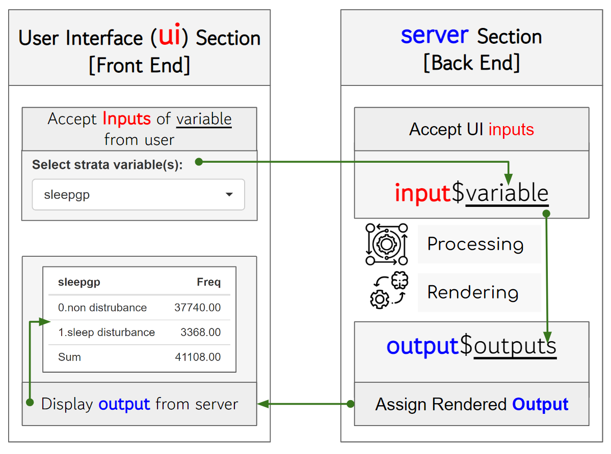

# (PART\*) Interractive dashboard {-}
# Shiny


## KWCS data preparation
Prior to start about shiny, I will review the tabf code.
That code will download the kwcsData6th.rds file from the GitHub repository and save it as data/kwcs6th.rds on your local machine. Then, it will use the readRDS function to load the data into R as an object named dat1.


```r
rm(list=ls())
if(!require("tidyverse")) install.packages("tidyverse")
if(!require("htmlTable")) install.packages("htmlTable")
if(!require("broom")) install.packages("broom")
if(!require("devtools")) install.packages("devtools")
library(devtools)
if(!require("tabf")) install_github("jinhaslab/tabf", force = TRUE)
library(tabf)
# data download
url ="https://github.com/jinhaslab/opendata/raw/3006e12f54bd2abd3cd1aac9cda807ef8e614a42/kwcs/kwcsData6th.rds"
download.file(url, "data/kwcs6th.rds")
dat1 = readRDS("data/kwcs6th.rds")
```


```r

dat1 = dat1 %>%
  select("sleepgp", "wwa1gp", "shortReturn","shiftWork" , "njob", "sexgp",  "edugp", "empgp", "AGE","satisfaction")
library(labelled)
dat1 = remove_labels(dat1) 
```

This code uses the %>% operator from the dplyr package to filter the columns of the dat1 data frame. The select function is used to specify the columns to keep in the filtered data frame.

The selected columns are:

* variables
  * "sleepgp": Sleep status group
  * "wwa1gp": Weekly working hours group
  * "shortReturn": Whether the respondent has a short return time from work or not
  * "shiftWork": Whether the respondent works shifts or not
  * "njob": Number of jobs
  * "sexgp": Sex group
  * "edugp": Education level group
  * "empgp": Employment group
  * "AGE": Age
  * "satisfaction": Work satisfaction
  
After the data frame has been filtered, only the specified columns will remain in the data frame, and all other columns will be dropped. This can be useful for simplifying your data set and focusing your analysis on specific variables.


## remind Table 1 for KWCS


Code is specifying that the variables should be stratified by the single variable "sleepgp", and that the categorical variables are "wwa1gp", "shortReturn", "shiftWork", "njob", "sexgp", "edugp", and "empgp", while the continuous variables are "AGE" and "satisfaction". The function "tabf" is likely a custom function that generates the Table 1 summary based on these inputs. Finally, the "htmlTable" function is being used to output the results in an HTML table format, which can be easily viewed in a web browser or other software that can render HTML tables.


```r

stratas  = c("sleepgp")
catVars = c("wwa1gp", "shortReturn","shiftWork" , "njob", "sexgp",  "edugp", "empgp")
conVars = c("AGE","satisfaction")
tab1 = tabf(dat1=dat1, stratas = stratas, catVars = catVars, conVars = conVars)
tab1 %>% htmlTable(align ="l") 
```

<table class='gmisc_table' style='border-collapse: collapse; margin-top: 1em; margin-bottom: 1em;' >
<thead>
<tr><th style='border-bottom: 1px solid grey; border-top: 2px solid grey;'></th>
<th style='font-weight: 900; border-bottom: 1px solid grey; border-top: 2px solid grey; text-align: center;'>variables</th>
<th style='font-weight: 900; border-bottom: 1px solid grey; border-top: 2px solid grey; text-align: center;'>values</th>
<th style='font-weight: 900; border-bottom: 1px solid grey; border-top: 2px solid grey; text-align: center;'>0.non distrubance</th>
<th style='font-weight: 900; border-bottom: 1px solid grey; border-top: 2px solid grey; text-align: center;'>1.sleep disturbance</th>
<th style='font-weight: 900; border-bottom: 1px solid grey; border-top: 2px solid grey; text-align: center;'>p.value</th>
</tr>
</thead>
<tbody>
<tr>
<td style='text-align: left;'>1</td>
<td style='text-align: left;'>AGE</td>
<td style='text-align: left;'></td>
<td style='text-align: left;'>46.8±12.4</td>
<td style='text-align: left;'>49.7±11.9</td>
<td style='text-align: left;'><0.001</td>
</tr>
<tr>
<td style='text-align: left;'>2</td>
<td style='text-align: left;'>wwa1gp</td>
<td style='text-align: left;'>Never</td>
<td style='text-align: left;'>12222 (94.7%)</td>
<td style='text-align: left;'>684 (5.3%)</td>
<td style='text-align: left;'><0.001</td>
</tr>
<tr>
<td style='text-align: left;'>3</td>
<td style='text-align: left;'></td>
<td style='text-align: left;'>Rarely</td>
<td style='text-align: left;'>12316 (94.5%)</td>
<td style='text-align: left;'>714 (5.5%)</td>
<td style='text-align: left;'></td>
</tr>
<tr>
<td style='text-align: left;'>4</td>
<td style='text-align: left;'></td>
<td style='text-align: left;'>Sometimes</td>
<td style='text-align: left;'>9112 (90.3%)</td>
<td style='text-align: left;'>981 (9.7%)</td>
<td style='text-align: left;'></td>
</tr>
<tr>
<td style='text-align: left;'>5</td>
<td style='text-align: left;'></td>
<td style='text-align: left;'>Often</td>
<td style='text-align: left;'>3456 (82.8%)</td>
<td style='text-align: left;'>717 (17.2%)</td>
<td style='text-align: left;'></td>
</tr>
<tr>
<td style='text-align: left;'>6</td>
<td style='text-align: left;'></td>
<td style='text-align: left;'>Always</td>
<td style='text-align: left;'>634 (70.0%)</td>
<td style='text-align: left;'>272 (30.0%)</td>
<td style='text-align: left;'></td>
</tr>
<tr>
<td style='text-align: left;'>7</td>
<td style='text-align: left;'>satisfaction</td>
<td style='text-align: left;'></td>
<td style='text-align: left;'>2.1±0.5</td>
<td style='text-align: left;'>2.4±0.6</td>
<td style='text-align: left;'><0.001</td>
</tr>
<tr>
<td style='text-align: left;'>8</td>
<td style='text-align: left;'>shortReturn</td>
<td style='text-align: left;'>non short return</td>
<td style='text-align: left;'>36183 (92.5%)</td>
<td style='text-align: left;'>2927 (7.5%)</td>
<td style='text-align: left;'><0.001</td>
</tr>
<tr>
<td style='text-align: left;'>9</td>
<td style='text-align: left;'></td>
<td style='text-align: left;'>short return</td>
<td style='text-align: left;'>1557 (77.9%)</td>
<td style='text-align: left;'>441 (22.1%)</td>
<td style='text-align: left;'></td>
</tr>
<tr>
<td style='text-align: left;'>10</td>
<td style='text-align: left;'>shiftWork</td>
<td style='text-align: left;'>non shift work</td>
<td style='text-align: left;'>35056 (91.9%)</td>
<td style='text-align: left;'>3073 (8.1%)</td>
<td style='text-align: left;'><0.001</td>
</tr>
<tr>
<td style='text-align: left;'>11</td>
<td style='text-align: left;'></td>
<td style='text-align: left;'>shift work</td>
<td style='text-align: left;'>2684 (90.1%)</td>
<td style='text-align: left;'>295 (9.9%)</td>
<td style='text-align: left;'></td>
</tr>
<tr>
<td style='text-align: left;'>12</td>
<td style='text-align: left;'>njob</td>
<td style='text-align: left;'>one-job</td>
<td style='text-align: left;'>37471 (91.9%)</td>
<td style='text-align: left;'>3317 (8.1%)</td>
<td style='text-align: left;'><0.001</td>
</tr>
<tr>
<td style='text-align: left;'>13</td>
<td style='text-align: left;'></td>
<td style='text-align: left;'>njob</td>
<td style='text-align: left;'>269 (84.1%)</td>
<td style='text-align: left;'>51 (15.9%)</td>
<td style='text-align: left;'></td>
</tr>
<tr>
<td style='text-align: left;'>14</td>
<td style='text-align: left;'>sexgp</td>
<td style='text-align: left;'>Men</td>
<td style='text-align: left;'>17892 (93.1%)</td>
<td style='text-align: left;'>1327 (6.9%)</td>
<td style='text-align: left;'><0.001</td>
</tr>
<tr>
<td style='text-align: left;'>15</td>
<td style='text-align: left;'></td>
<td style='text-align: left;'>Women</td>
<td style='text-align: left;'>19848 (90.7%)</td>
<td style='text-align: left;'>2041 (9.3%)</td>
<td style='text-align: left;'></td>
</tr>
<tr>
<td style='text-align: left;'>16</td>
<td style='text-align: left;'>edugp</td>
<td style='text-align: left;'>university or more</td>
<td style='text-align: left;'>19597 (92.9%)</td>
<td style='text-align: left;'>1502 (7.1%)</td>
<td style='text-align: left;'><0.001</td>
</tr>
<tr>
<td style='text-align: left;'>17</td>
<td style='text-align: left;'></td>
<td style='text-align: left;'>high school</td>
<td style='text-align: left;'>14943 (91.9%)</td>
<td style='text-align: left;'>1318 (8.1%)</td>
<td style='text-align: left;'></td>
</tr>
<tr>
<td style='text-align: left;'>18</td>
<td style='text-align: left;'></td>
<td style='text-align: left;'>middle school or below</td>
<td style='text-align: left;'>3200 (85.4%)</td>
<td style='text-align: left;'>548 (14.6%)</td>
<td style='text-align: left;'></td>
</tr>
<tr>
<td style='text-align: left;'>19</td>
<td style='text-align: left;'>empgp</td>
<td style='text-align: left;'>paid-worker</td>
<td style='text-align: left;'>25786 (92.4%)</td>
<td style='text-align: left;'>2122 (7.6%)</td>
<td style='text-align: left;'><0.001</td>
</tr>
<tr>
<td style='text-align: left;'>20</td>
<td style='text-align: left;'></td>
<td style='text-align: left;'>employer/self-employer</td>
<td style='text-align: left;'>2539 (91.7%)</td>
<td style='text-align: left;'>229 (8.3%)</td>
<td style='text-align: left;'></td>
</tr>
<tr>
<td style='text-align: left;'>21</td>
<td style='text-align: left;'></td>
<td style='text-align: left;'>own-account worker</td>
<td style='text-align: left;'>8359 (90.5%)</td>
<td style='text-align: left;'>880 (9.5%)</td>
<td style='text-align: left;'></td>
</tr>
<tr>
<td style='border-bottom: 2px solid grey; text-align: left;'>22</td>
<td style='border-bottom: 2px solid grey; text-align: left;'></td>
<td style='border-bottom: 2px solid grey; text-align: left;'>unpaind family work</td>
<td style='border-bottom: 2px solid grey; text-align: left;'>1056 (88.5%)</td>
<td style='border-bottom: 2px solid grey; text-align: left;'>137 (11.5%)</td>
<td style='border-bottom: 2px solid grey; text-align: left;'></td>
</tr>
</tbody>
</table>


## Introduction shiny

R Shiny is a web application framework for R programming language that provides an interactive and simple way for data analysis and visualization. The official documentation for Shiny can be found at https://shiny.rstudio.com/ and provides comprehensive information on using Shiny for web application development. <br>
At this moment, I just introduced Shiny using KWCS data.


Let install shiny

```r
if(!require("shiny")) install.packages(shiny)
library(shiny)
```
### basic structure of shiny

This code defines the UI and server components of a Shiny app and then runs the app using the shinyApp() function.

In the ui component, you define the user interface of the app using R code. This typically includes elements like input controls (e.g. sliders, text boxes, dropdown menus) and output displays (e.g. plots, tables, text).

In the server component, you define the server-side logic of the app. This code processes user inputs, performs calculations, and generates output for the UI to display. In the server function, you typically define reactive expressions and use Shiny's reactive programming features to create dynamic behavior in the app.


```r
library(shiny)

# Define UI
ui <- fluidPage(
  # User interface components go here
)

# Define server
server <- function(input, output) {
  # Server-side logic and output generation go here
}

# Run the app
shinyApp(ui = ui, server = server)
```


> seperate file of shiny

you can separate the UI, server, and global code into separate files in a Shiny app. This can make your code easier to organize and maintain, especially for larger apps.

Here's an example of how you can structure your code into separate files:

1. ui.R: This file contains the code for the user interface of the app.


```r
library(shiny)

# Define UI
ui <- fluidPage(
  # User interface components go here
)

```

2. server.R: This file contains the server-side logic and output generation of the app.

```r
library(shiny)

# Define server
server <- function(input, output) {
  # Server-side logic and output generation go here
}

```

3. global.R: This file contains any global code that needs to be shared across the app, such as data loading or library imports.


```r
# Global code goes here
library(tidyverse)
dat1 = readRDS("data/kwcs6th.rds")
```

4. run the app


## communication between ui, server

The user interface section of a Shiny app receives user input variables and sends them to the server section for processing. The server section accepts the input variables from the user interface, applies the necessary processing and rendering steps, generates output variables, and sends them back to the user interface. Finally, the user interface receives the output variables from the server section and displays them to the user



User input: The user interacts with input widgets defined in the user interface section of the app. These input widgets can take a variety of forms, such as text boxes, sliders, and buttons.

Input variables: When the user interacts with an input widget, an input variable is generated. This variable contains the data entered by the user, such as the text typed into a text box or the value selected from a dropdown menu.

Sending inputs to the server: The user interface section sends the input variables to the server section of the app. This happens automatically and in real-time, using reactive programming techniques.

Processing input variables: The server section receives the input variables from the user interface and processes them as needed. This might involve performing calculations, filtering data, or running complex algorithms.

Rendering output: Once the input variables have been processed, the server section generates output variables. These variables contain the data that will be displayed to the user, such as a plot, a table, or a text string. The server section also applies any necessary formatting or styling to the output variables.

Sending outputs to the user interface: The server section sends the output variables back to the user interface section of the app. Again, this happens automatically and in real-time, using reactive programming techniques.

Displaying outputs to the user: The user interface section receives the output variables from the server section and displays them to the user. This might involve rendering the output as a plot, table, or text string, depending on the specific output format of the app. The output elements in the user interface are reactive, meaning they update in real-time as the input variables are changed by the user.

## shiny UI structures


Now, we discuss an overview of the structure of the user interface (UI) section in Shiny, specifically focusing on the use of sidebarPanel, mainPanel, tabsetPanel, inputWidgets, and actionButton.

sidebarLayout(): Creates a two-panel layout with a sidebar on the left and a main panel on the right.

sidebarPanel(): Defines the content for the sidebar panel, which typically contains input widgets, such as sliders, dropdown menus, or text input boxes.

mainPanel(): Defines the content for the main panel, which typically contains output elements, such as tables, plots, or text output.

tabsetPanel(): Organizes the UI into multiple tabs, with different content displayed in each tab.

actionButton(): Creates a button widget that the user can click to trigger an action in the app.


## Input and ouput

The first code chunk defines the user interface (UI) for a Shiny app. The UI consists of a text input box labeled "What is your outcome?" with a default value of "Sleep problem", and a verbatim text output labeled "myoutput".

The second code chunk defines the server-side logic for the Shiny app. Specifically, it creates a reactive expression that renders the text entered in the input box as the output.

The third code chunk loads a data file named "kwcs6th.rds" as a data frame called "dat1" using the readRDS() function from the tidyverse package.


```r
ui <- fluidPage(
  # Create input text box
  textInput("myquestion", "What is your outcome:", value = "Sleep problem"),
  
  # Create output
  verbatimTextOutput("myoutput")
)
```


```r
# Define server
server <- function(input, output) {
  # Define reactive expression for output
  output$myoutput <- renderPrint({
    input$myquestion
  })
}
```


```r
library(tidyverse)
dat1 = readRDS("data/kwcs6th.rds")
dat1 = dat1 %>%
  select("sleepgp", "wwa1gp", "shortReturn","shiftWork" , "njob", "sexgp",  "edugp", "empgp", "AGE","satisfaction")
gg = names(dat1)
```


> Input and server feedback

This code creates a dropdown menu for selecting the strata variable, and a table output object named "tableoutput1".

The server function subsets the data to the selected strata variable using the input$strata variable and creates a table of the frequency of each category in the selected variable. The addmargins() function is used to add a row and column to the table with the totals.


```r
ui <- fluidPage(

  # Create output
 selectInput("smry", "Select variables of summary:", choices = gg, selected = c("sleepgp")), 
 
 tableOutput("tableoutput1")
)
```


```r
server <- function(input, output) {
  # Define reactive expression for output
  output$myoutput <- renderPrint({
    input$myquestion
  })
  selected_smry <- reactive({input$smry})
  output$tableoutput1 <- renderTable({
    dat1 %>% select(all_of(selected_smry())) %>% table() %>% 
      addmargins() 
  })
}
```


```r
library(tidyverse)
dat1 = readRDS("data/kwcs6th.rds")

dat1 = dat1 %>%
  select("sleepgp", "wwa1gp", "shortReturn","shiftWork" , "njob", "sexgp",  "edugp", "empgp", "AGE","satisfaction")
gg = names(dat1)

```


 if the selected variable is numeric, the table() function may not be the most suitable way to summarize the data. Instead, you can use the summarize() function from the tidyverse package to calculate the mean and standard deviation of the selected variable. 
 
 

```r
server <- function(input, output) {
  # Define reactive expression for output

  selected_smry <- reactive({input$smry})
  output$tableoutput1 <- renderTable({
    
    if(is.numeric(dat1 %>% pull(selected_smry()))){
      dat1 %>% summarize(mean=mean(!!sym(selected_smry())), 
                         sd=sd(!!sym(selected_smry())))
    } else {
      dat1 %>% select(all_of(selected_smry())) %>% table() %>% 
      addmargins() 
    }
  })
}
```
 


> Tab pannel

The code defines the user interface (UI) for a Shiny app that contains a tabsetPanel with two tabPanels named "Summary Table" and "Table 1". The UI includes two tabs, but neither tab has any content or input widgets


```r
ui <- fluidPage(
  tabsetPanel(
    tabPanel("Summary Table"),
    tabPanel("Table 1")
  )
)
```

Now, the "Summary Table" tabPanel includes a selectInput widget called "smry" and a tableOutput widget called "tableoutput1", which are defined as outputs for the server function.


```r
ui <- fluidPage(
  
  tabsetPanel(
    tabPanel("Summary Table",
  
  # Create output
  selectInput("smry", "Select variables of summary:", choices = gg, selected = c("sleepgp")), 
  
  tableOutput("tableoutput1")
  )), 
  tabPanel("Table 1")
  
  
)
```


> Multiple input and Table 1

Remind following code of Table 1. We will use following code in shiny

```r
stratas  = c("sleepgp")
catVars = c("wwa1gp", "shortReturn","shiftWork" , "njob", "sexgp",  "edugp", "empgp")
conVars = c("AGE","satisfaction")
tab1 = tabf(dat1=dat1, stratas = stratas, catVars = catVars, conVars = conVars)
tab1 %>% htmlTable(align ="l") 
```

for ui, this app has two tabs: one for the Summary Table and one for the Table 1 summary. In the Summary Table tab, the user can select one or more variables from a dropdown menu called "smry", and the app generates a summary table that shows summary statistics for the selected variables. F
In the Table 1 tab, the user can select a strata variable from a dropdown menu called "stratas", one or more categorical variables from a dropdown menu called "catVars", and one or more continuous variables from a dropdown menu called "conVars". The app then generates a Table 1 summary for the selected variables stratified by the selected strata variable. 

```r
ui <- fluidPage(
  
  tabsetPanel(
    tabPanel("Summary Table",
             
             # Create output
             selectInput("smry", "Select variables of summary:", 
                         choices = gg, selected = c("sleepgp")), 
             
             tableOutput("tableoutput1")
    ), 
    tabPanel("Table 1", 
             
             # Create dropdown for strata variables
             selectInput("stratas", "Select strata variable(s):", 
                         choices = c("None", names(dat1)), 
                         selected = "sleepgp", multiple = FALSE),
             
             # Create dropdown for categorical variables
             selectInput("catVars", "Select categorical variable(s):", 
                         choices = c("None"), 
                         selected = "wwa1gp", multiple = TRUE),
             
             # Create dropdown for continuous variables
             selectInput("conVars", "Select continuous variable(s):", 
                         choices = c("None", names(dat1)[sapply(dat1, is.numeric)]), 
                         selected = "AGE", multiple = TRUE),
             
             # Output table for Table 1
             uiOutput("table1")
             
    )))

```


The server component of the app includes reactive expressions that update the dropdown menus dynamically based on the user's selections, as well as the "tabf" function that generates the Table 1 summary based on the selected variables and strata variable. The resulting Table 1 summary is output in an HTML table format using the "htmlTable" function from the "htmlTable" package.


```r
server <- function(input, output, session) {
  # Define reactive expression for output
  
  selected_smry <- reactive({input$smry})
  output$tableoutput1 <- renderTable({
    
    if(is.numeric(dat1 %>% pull(selected_smry()))){
      dat1 %>% summarize(mean=mean(!!sym(selected_smry())), 
                         sd=sd(!!sym(selected_smry())))
    } else {
      dat1 %>% select(all_of(selected_smry())) %>% table() %>% 
        addmargins() 
    }
  })
  
  
  catVars <- reactive(input$catVars)
  conVars <- reactive(input$conVars)
  
  selectedstrata <- reactive(input$stratas)
  observe({
    char = names(dat1)[(sapply(dat1, is.character))]
    choices <- char[char!=selectedstrata()]
     updatePickerInput(session, "catVars", choices = choices, selected = "None")
  })
  
  
  tab1 = reactive(tabf(dat1=dat1, stratas = selectedstrata(), catVars = catVars(), conVars = conVars()))
   output$table1 = renderUI(tab1() %>% htmlTable(align ="l"))
  
}
```


> SidebarLayout

In the Summary Table tab, the sidebarLayout function is used to create a layout with a sidebar panel and a main panel. The selectInput function for the "smry" variable is placed in the sidebar panel, and the tableOutput function is placed in the main panel. This allows the user to select the variables to summarize in the sidebar, while the resulting table is displayed in the main panel.


```r
ui <- fluidPage(
  
  tabsetPanel(
    tabPanel("Summary Table",
             sidebarLayout(     
               sidebarPanel(
             
             # Create output
             selectInput("smry", "Select variables of summary:", choices = gg, selected = c("sleepgp"))
             ), 
             
            mainPanel(
              tableOutput("tableoutput1")
              )
    )), 
    tabPanel("Table 1", 
             sidebarLayout(
               sidebarPanel(
             # Create dropdown for strata variables
             selectInput("stratas", "Select strata variable(s):", 
                         choices = c("None", names(dat1)), 
                         selected = "sleepgp", multiple = FALSE),
             
             # Create dropdown for categorical variables
             selectInput("catVars", "Select categorical variable(s):", 
                         choices = c("None"), 
                         selected = "wwa1gp", multiple = TRUE),
             
             # Create dropdown for continuous variables
             selectInput("conVars", "Select continuous variable(s):", 
                         choices = c("None", names(dat1)[sapply(dat1, is.numeric)]), 
                         selected = "AGE", multiple = TRUE)
             ),
             
             # Output table for Table 1
             mainPanel(
               uiOutput("table1")
             ))
    )
  )
)

```


## Picker Input and more

Yes, you can add the installation and library loading code for the shinyWidgets package in the global environment of your Shiny app.


```r
if(!require("shinyWidgets")) install.packages("shinyWidgets")
library(shinyWidgets)

```

The pickerInput function creates a dropdown menu with checkboxes for selecting multiple continuous variables. The choices argument specifies the available options for selection, and selected specifies the default selections. The options argument specifies the options for the picker input widget. Here, we've used pickerOptions to enable an actions box that allows the user to select/deselect all options at once.

```r
ui <- fluidPage(
  
  tabsetPanel(
    tabPanel("Summary Table",
             sidebarLayout(     
               sidebarPanel(
             
             # Create output
             selectInput("smry", "Select variables of summary:", choices = gg, selected = c("sleepgp"))
             ), 
             
            mainPanel(
              tableOutput("tableoutput1")
              )
    )), 
    tabPanel("Table 1", 
             sidebarLayout(
               sidebarPanel(
             # Create dropdown for strata variables
                 pickerInput("stratas", "Select strata variable(s):", 
                         choices = c("None", names(dat1)), 
                         selected = "sleepgp", multiple = FALSE, 
                         options = myPickerOptions
                         ),
             
             # Create dropdown for categorical variables
             pickerInput("catVars", "Select categorical variable(s):", 
                         choices = c("None"), 
                         selected = "wwa1gp", multiple = TRUE, 
                         options = myPickerOptions),
             
             # Create dropdown for continuous variables
             pickerInput("conVars", "Select continuous variable(s):", 
                         choices = c("None", names(dat1)[sapply(dat1, is.numeric)]), 
                         selected = "AGE", multiple = TRUE, 
                         options = myPickerOptions)
             ),
             
             # Output table for Table 1
             mainPanel(
               uiOutput("table1")
             ))
    )
  ))
```


The updatePickerInput function is used to dynamically update the dropdown menu options for categorical variables based on the selected strata variable.

The function takes several arguments:

session: the Shiny session object
inputId: the ID of the pickerInput widget to update
choices: a character vector of new choices for the pickerInput widget
selected: a character vector of selected choices for the pickerInput widget


```r
server <- function(input, output, session) {
  # Define reactive expression for output
  
  selected_smry <- reactive({input$smry})
  output$tableoutput1 <- renderTable({
    
    if(is.numeric(dat1 %>% pull(selected_smry()))){
      dat1 %>% summarize(mean=mean(!!sym(selected_smry())), 
                         sd=sd(!!sym(selected_smry())))
    } else {
      dat1 %>% select(all_of(selected_smry())) %>% table() %>% 
        addmargins() 
    }
  })
  
  
  catVars <- reactive(input$catVars)
  conVars <- reactive(input$conVars)
  
  selectedstrata <- reactive(input$stratas)
  observe({
    char = names(dat1)[(sapply(dat1, is.character))]
    choices <- char[char!=selectedstrata()]
     updatePickerInput(session, "catVars", choices = choices, selected = "None")
  })
  
  
  tab1 = reactive(tabf(dat1=dat1, stratas = selectedstrata(), catVars = catVars(), conVars = conVars()))
   output$table1 = renderUI(tab1() %>% htmlTable(align ="l"))
  
}
```


In global, We have also defined the myPickerOptions list, which is used to customize the options for the pickerInput widget.


```r
library(tidyverse)
dat1 = readRDS("data/kwcs6th.rds")

library(labelled)
dat1 = dat1 %>%
  select("sleepgp", "wwa1gp", "shortReturn","shiftWork" , "njob", "sexgp",  "edugp", "empgp", "AGE","satisfaction")
dat1 = remove_labels(dat1) 


gg = names(dat1) %>% as.list()


if(!require("devtools")) install.packages("devtools")
library(devtools)
if(!require("tabf")) install_github("jinhaslab/tabf", force = TRUE)
library(tabf)
if(!require("tidyverse")) install.packages("tidyverse")
if(!require("htmlTable")) install.packages("htmlTable")
if(!require("broom")) install.packages("broom")

if(!require("shinyWidgets")) install.packages("shinyWidgets")
library(shinyWidgets)

myPickerOptions <- list(
  `actions-box` = TRUE,
  `live-search` = TRUE,
  `selected-text-format` = "count > 2",
  search = TRUE
)

```


## Logistic Regression model

We have created three pickerInput widgets to select the dependent variable, independent variable(s), and reference categories for categorical variables. The options argument for the pickerInput widgets is set to myPickerOptions, which customizes the appearance of the dropdown menus.
We have also created an action button with label "Analysis Start" that the user can click to run the logistic regression model.


```r
ui <- fluidPage(
  
  tabsetPanel(
    tabPanel("Summary Table",
             sidebarLayout(     
               sidebarPanel(
             
             # Create output ----------------
             selectInput("smry", "Select variables of summary:", choices = gg, selected = c("sleepgp"))
             ), 
             
            mainPanel(
              tableOutput("tableoutput1")
              )
    )), 
    tabPanel("Table 1", 
             sidebarLayout(
               sidebarPanel(
             # Create dropdown for strata variables
                 pickerInput("stratas", "Select strata variable(s):", 
                         choices = c("None", names(dat1)), 
                         selected = "sleepgp", multiple = FALSE, 
                         options = myPickerOptions
                         ),
             
             # Create dropdown for categorical variables
             pickerInput("catVars", "Select categorical variable(s):", 
                         choices = c("None"), 
                         selected = "None", multiple = TRUE, 
                         options = myPickerOptions),
             
             # Create dropdown for continuous variables
             pickerInput("conVars", "Select continuous variable(s):", 
                         choices = c(names(dat1)[sapply(dat1, is.numeric)]), 
                         selected = "None", multiple = TRUE, 
                         options = myPickerOptions)
             ),
             
             # Output table for Table 1
             mainPanel(
               uiOutput("table1")
             ))
    ), 
    tabPanel("Logistic Model",
             sidebarLayout(
               sidebarPanel(  
                 pickerInput("Dependent", "Dependent Variable: ", 
                             choices = c("None", names(dat1)), 
                             selected = "sleepgp", multiple = FALSE)
                 ,
                 uiOutput("RefsChoice"),
                 pickerInput("Independent", "Independent Variable: ", 
                             choices = c("None"), 
                             selected = c("wwa1gp"), multiple = TRUE,
                             options = myPickerOptions)
                 ,
                 actionButton(inputId = "submit", label ="Analysis Start"),
                 
               ),
               mainPanel(tags$h3("model formular"),
                         htmlOutput("formular"), 
                         htmlOutput("mod1"))
             )
    )
  )
)

```


In server setting, 
First, We define the reactive expression RC, which gets the unique values of the dependent variable to use as the reference value for the logistic regression model. We then create an output called RefsChoice that uses a pickerInput widget to allow the user to select the reference category for categorical variables.

Next, We define the reactive expression SelectedDependent which retrieves the value of the dependent variable selected by the user. We then create an observer that updates the choices available for the independent variable dropdown based on the selected dependent variable.

We create two output elements: formular and mod1. The formular output generates a string that displays the logistic regression model formula based on the user's input. The mod1 output uses the glm function to fit a logistic regression model and generate the summary output using oddsTabf.


```r
server <- function(input, output, session) {
  # Define reactive expression for output
  
  selected_smry <- reactive({input$smry})
  output$tableoutput1 <- renderTable({
    
    if(is.numeric(dat1 %>% pull(selected_smry()))){
      dat1 %>% summarize(mean=mean(!!sym(selected_smry())), 
                         sd=sd(!!sym(selected_smry())))
    } else {
      dat1 %>% select(all_of(selected_smry())) %>% table() %>% 
        addmargins() 
    }
  })
  
  
  catVars <- reactive(input$catVars)
  conVars <- reactive(input$conVars)
  
  selectedstrata <- reactive(input$stratas)
  observe({
    char = names(dat1)[(sapply(dat1, is.character))]
    choices <- char[char!=selectedstrata()]
     updatePickerInput(session, "catVars", choices = choices, selected = "None")
  })
  
tab1 = reactive({
  if (is.null(catVars())) {
    tabf(dat1=dat1, stratas = selectedstrata(), conVars = conVars())
  } else if (is.null(conVars())) {
    tabf(dat1=dat1, stratas = selectedstrata(), catVars = catVars())
  } else {
    tabf(dat1=dat1, stratas = selectedstrata(), catVars = catVars(), conVars = conVars())
  }
})

output$table1 = renderUI({
  validate(need(catVars(), "Select variables"))
  tab1() %>% htmlTable(align ="l")
})


   
   
   # logistic regression
   ## reference value
   RC <-  reactive({ validate(
                     need(input$Dependent, "Dependent variable") )
                     dat1 %>% select(input$Dependent) %>% unique() %>% pull(.)
                     })
   
   output$RefsChoice <- renderUI({
                     pickerInput("Refs", "Odds for:",
                     list(`odds for` = RC()))
                      })
   ## independent variable
   SelectedDependent <- reactive(input$Dependent)
   observe({
     char2 = names(dat1)
     choices2 <- char2[char2!=SelectedDependent()]
     updatePickerInput(session, "Independent", choices = choices2, selected = c("None"), 
                                            options = myPickerOptions)
   })
   output$formular <- renderUI({
     form <- HTML(sprintf("<h3> %s == '%s' <br/> ~ %s </h3>",input$Dependent, input$Refs  ,paste0(input$Independent, collapse=" + ")))
   })
   
   output$mod1  <- renderUI({
     validate( need(input$Independent, "Select independent variable") )
     f1 <- sprintf("%s == '%s' ~ %s ",
                   input$Dependent, input$Refs  ,
                   paste0(input$Independent, collapse=" + "))
     mod1 <- glm(data=dat1,family=binomial(), as.formula(f1))
      oddsTabf(mod1)
   })
   
  
}
```

The global is same as we made. 


```r
library(tidyverse)
dat1 = readRDS("data/kwcs6th.rds")

library(labelled)
dat1 = dat1 %>%
  select("sleepgp", "wwa1gp", "shortReturn","shiftWork" , "njob", "sexgp",  "edugp", "empgp", "AGE","satisfaction")
dat1 = remove_labels(dat1) 


gg = names(dat1) %>% as.list()


if(!require("devtools")) install.packages("devtools")
library(devtools)
if(!require("tabf")) install_github("jinhaslab/tabf", force = TRUE)
library(tabf)
if(!require("tidyverse")) install.packages("tidyverse")
if(!require("htmlTable")) install.packages("htmlTable")
if(!require("broom")) install.packages("broom")

if(!require("shinyWidgets")) install.packages("shinyWidgets")
library(shinyWidgets)

myPickerOptions <- list(
  `actions-box` = TRUE,
  `live-search` = TRUE,
  `selected-text-format` = "count > 2",
  search = TRUE
)

```


