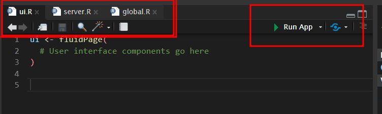

# Shiny


## KWCS data preparation
Prior to start about shiny, I will review the tabf code.
That code will download the kwcsData6th.rds file from the GitHub repository and save it as data/kwcs6th.rds on your local machine. Then, it will use the readRDS function to load the data into R as an object named dat1.
After you have loaded the data into R, you can start exploring and analyzing it. You can use the str function to inspect the structure of the data and the head function to see the first few rows of the data.


```r
rm(list=ls())
if(!require("tidyverse")) install.packages("tidyverse")
if(!require("htmlTable")) install.packages("htmlTable")
if(!require("broom")) install.packages("broom")
if(!require("devtools")) install.packages("devtools")
library(devtools)
if(!require("tabf")) install_github("jinhaslab/tabf", force = TRUE)
library(tabf)
# data download
url ="https://github.com/jinhaslab/opendata/raw/3006e12f54bd2abd3cd1aac9cda807ef8e614a42/kwcs/kwcsData6th.rds"
download.file(url, "data/kwcs6th.rds")
dat1 = readRDS("data/kwcs6th.rds")
```


```r

dat1 = dat1 %>%
  select("sleepgp", "wwa1gp", "shortReturn","shiftWork" , "njob", "sexgp",  "edugp", "empgp", "AGE","satisfaction")
library(labelled)
dat1 = remove_labels(dat1) 
```

This code uses the %>% operator from the dplyr package to filter the columns of the dat1 data frame. The select function is used to specify the columns to keep in the filtered data frame.

The selected columns are:

* variables
  * "sleepgp": Sleep status group
  * "wwa1gp": Weekly working hours group
  * "shortReturn": Whether the respondent has a short return time from work or not
  * "shiftWork": Whether the respondent works shifts or not
  * "njob": Number of jobs
  * "sexgp": Sex group
  * "edugp": Education level group
  * "empgp": Employment group
  * "AGE": Age
  * "satisfaction": Work satisfaction
  
After the data frame has been filtered, only the specified columns will remain in the data frame, and all other columns will be dropped. This can be useful for simplifying your data set and focusing your analysis on specific variables.


## remind Table 1 for KWCS

This is code to generate a table using the tabf function to compute frequencies and percentages for categorical variables, and means and standard deviations for continuous variables. The table is formatted using the htmlTable function, which creates an HTML table.

The setNames function is used to set the names for the columns of the table, and the c function is used to concatenate different variables.

The cgroup argument in the htmlTable function is used to group the columns of the table. The n.cgroup argument specifies the number of columns in each group. The tfoot argument adds a table footer, and the rnames argument specifies that the table should not include row names.

Finally, the caption argument specifies the table caption, and the css.table argument sets the font family for the table.


```r

stratas  = c("sleepgp")
catVars = c("wwa1gp", "shortReturn","shiftWork" , "njob", "sexgp",  "edugp", "empgp")
conVars = c("AGE","satisfaction")
tab1 = tabf(dat1=dat1, stratas = stratas, catVars = catVars, conVars = conVars)
tab1 %>% htmlTable(align ="l") 
```

<table class='gmisc_table' style='border-collapse: collapse; margin-top: 1em; margin-bottom: 1em;' >
<thead>
<tr><th style='border-bottom: 1px solid grey; border-top: 2px solid grey;'></th>
<th style='font-weight: 900; border-bottom: 1px solid grey; border-top: 2px solid grey; text-align: center;'>variables</th>
<th style='font-weight: 900; border-bottom: 1px solid grey; border-top: 2px solid grey; text-align: center;'>values</th>
<th style='font-weight: 900; border-bottom: 1px solid grey; border-top: 2px solid grey; text-align: center;'>0.non distrubance</th>
<th style='font-weight: 900; border-bottom: 1px solid grey; border-top: 2px solid grey; text-align: center;'>1.sleep disturbance</th>
<th style='font-weight: 900; border-bottom: 1px solid grey; border-top: 2px solid grey; text-align: center;'>p.value</th>
</tr>
</thead>
<tbody>
<tr>
<td style='text-align: left;'>1</td>
<td style='text-align: left;'>AGE</td>
<td style='text-align: left;'></td>
<td style='text-align: left;'>46.8±12.4</td>
<td style='text-align: left;'>49.7±11.9</td>
<td style='text-align: left;'><0.001</td>
</tr>
<tr>
<td style='text-align: left;'>2</td>
<td style='text-align: left;'>wwa1gp</td>
<td style='text-align: left;'>Never</td>
<td style='text-align: left;'>12222 (94.7%)</td>
<td style='text-align: left;'>684 (5.3%)</td>
<td style='text-align: left;'><0.001</td>
</tr>
<tr>
<td style='text-align: left;'>3</td>
<td style='text-align: left;'></td>
<td style='text-align: left;'>Rarely</td>
<td style='text-align: left;'>12316 (94.5%)</td>
<td style='text-align: left;'>714 (5.5%)</td>
<td style='text-align: left;'></td>
</tr>
<tr>
<td style='text-align: left;'>4</td>
<td style='text-align: left;'></td>
<td style='text-align: left;'>Sometimes</td>
<td style='text-align: left;'>9112 (90.3%)</td>
<td style='text-align: left;'>981 (9.7%)</td>
<td style='text-align: left;'></td>
</tr>
<tr>
<td style='text-align: left;'>5</td>
<td style='text-align: left;'></td>
<td style='text-align: left;'>Often</td>
<td style='text-align: left;'>3456 (82.8%)</td>
<td style='text-align: left;'>717 (17.2%)</td>
<td style='text-align: left;'></td>
</tr>
<tr>
<td style='text-align: left;'>6</td>
<td style='text-align: left;'></td>
<td style='text-align: left;'>Always</td>
<td style='text-align: left;'>634 (70.0%)</td>
<td style='text-align: left;'>272 (30.0%)</td>
<td style='text-align: left;'></td>
</tr>
<tr>
<td style='text-align: left;'>7</td>
<td style='text-align: left;'>satisfaction</td>
<td style='text-align: left;'></td>
<td style='text-align: left;'>2.1±0.5</td>
<td style='text-align: left;'>2.4±0.6</td>
<td style='text-align: left;'><0.001</td>
</tr>
<tr>
<td style='text-align: left;'>8</td>
<td style='text-align: left;'>shortReturn</td>
<td style='text-align: left;'>non short return</td>
<td style='text-align: left;'>36183 (92.5%)</td>
<td style='text-align: left;'>2927 (7.5%)</td>
<td style='text-align: left;'><0.001</td>
</tr>
<tr>
<td style='text-align: left;'>9</td>
<td style='text-align: left;'></td>
<td style='text-align: left;'>short return</td>
<td style='text-align: left;'>1557 (77.9%)</td>
<td style='text-align: left;'>441 (22.1%)</td>
<td style='text-align: left;'></td>
</tr>
<tr>
<td style='text-align: left;'>10</td>
<td style='text-align: left;'>shiftWork</td>
<td style='text-align: left;'>non shift work</td>
<td style='text-align: left;'>35056 (91.9%)</td>
<td style='text-align: left;'>3073 (8.1%)</td>
<td style='text-align: left;'><0.001</td>
</tr>
<tr>
<td style='text-align: left;'>11</td>
<td style='text-align: left;'></td>
<td style='text-align: left;'>shift work</td>
<td style='text-align: left;'>2684 (90.1%)</td>
<td style='text-align: left;'>295 (9.9%)</td>
<td style='text-align: left;'></td>
</tr>
<tr>
<td style='text-align: left;'>12</td>
<td style='text-align: left;'>njob</td>
<td style='text-align: left;'>one-job</td>
<td style='text-align: left;'>37471 (91.9%)</td>
<td style='text-align: left;'>3317 (8.1%)</td>
<td style='text-align: left;'><0.001</td>
</tr>
<tr>
<td style='text-align: left;'>13</td>
<td style='text-align: left;'></td>
<td style='text-align: left;'>njob</td>
<td style='text-align: left;'>269 (84.1%)</td>
<td style='text-align: left;'>51 (15.9%)</td>
<td style='text-align: left;'></td>
</tr>
<tr>
<td style='text-align: left;'>14</td>
<td style='text-align: left;'>sexgp</td>
<td style='text-align: left;'>Men</td>
<td style='text-align: left;'>17892 (93.1%)</td>
<td style='text-align: left;'>1327 (6.9%)</td>
<td style='text-align: left;'><0.001</td>
</tr>
<tr>
<td style='text-align: left;'>15</td>
<td style='text-align: left;'></td>
<td style='text-align: left;'>Women</td>
<td style='text-align: left;'>19848 (90.7%)</td>
<td style='text-align: left;'>2041 (9.3%)</td>
<td style='text-align: left;'></td>
</tr>
<tr>
<td style='text-align: left;'>16</td>
<td style='text-align: left;'>edugp</td>
<td style='text-align: left;'>university or more</td>
<td style='text-align: left;'>19597 (92.9%)</td>
<td style='text-align: left;'>1502 (7.1%)</td>
<td style='text-align: left;'><0.001</td>
</tr>
<tr>
<td style='text-align: left;'>17</td>
<td style='text-align: left;'></td>
<td style='text-align: left;'>high school</td>
<td style='text-align: left;'>14943 (91.9%)</td>
<td style='text-align: left;'>1318 (8.1%)</td>
<td style='text-align: left;'></td>
</tr>
<tr>
<td style='text-align: left;'>18</td>
<td style='text-align: left;'></td>
<td style='text-align: left;'>middle school or below</td>
<td style='text-align: left;'>3200 (85.4%)</td>
<td style='text-align: left;'>548 (14.6%)</td>
<td style='text-align: left;'></td>
</tr>
<tr>
<td style='text-align: left;'>19</td>
<td style='text-align: left;'>empgp</td>
<td style='text-align: left;'>paid-worker</td>
<td style='text-align: left;'>25786 (92.4%)</td>
<td style='text-align: left;'>2122 (7.6%)</td>
<td style='text-align: left;'><0.001</td>
</tr>
<tr>
<td style='text-align: left;'>20</td>
<td style='text-align: left;'></td>
<td style='text-align: left;'>employer/self-employer</td>
<td style='text-align: left;'>2539 (91.7%)</td>
<td style='text-align: left;'>229 (8.3%)</td>
<td style='text-align: left;'></td>
</tr>
<tr>
<td style='text-align: left;'>21</td>
<td style='text-align: left;'></td>
<td style='text-align: left;'>own-account worker</td>
<td style='text-align: left;'>8359 (90.5%)</td>
<td style='text-align: left;'>880 (9.5%)</td>
<td style='text-align: left;'></td>
</tr>
<tr>
<td style='border-bottom: 2px solid grey; text-align: left;'>22</td>
<td style='border-bottom: 2px solid grey; text-align: left;'></td>
<td style='border-bottom: 2px solid grey; text-align: left;'>unpaind family work</td>
<td style='border-bottom: 2px solid grey; text-align: left;'>1056 (88.5%)</td>
<td style='border-bottom: 2px solid grey; text-align: left;'>137 (11.5%)</td>
<td style='border-bottom: 2px solid grey; text-align: left;'></td>
</tr>
</tbody>
</table>


## Introduction shiny

R Shiny is a web application framework for R programming language that provides an interactive and simple way for data analysis and visualization. The official documentation for Shiny can be found at https://shiny.rstudio.com/ and provides comprehensive information on using Shiny for web application development. <br>
At this moment, I just introduced Shiny using KWCS data.


Let install shiny

```r
if(!require("shiny")) install.packages(shiny)
library(shiny)
```
### basic structure of shiny

This code defines the UI and server components of a Shiny app and then runs the app using the shinyApp() function.

In the ui component, you define the user interface of the app using R code. This typically includes elements like input controls (e.g. sliders, text boxes, dropdown menus) and output displays (e.g. plots, tables, text).

In the server component, you define the server-side logic of the app. This code processes user inputs, performs calculations, and generates output for the UI to display. In the server function, you typically define reactive expressions and use Shiny's reactive programming features to create dynamic behavior in the app.


```r
library(shiny)

# Define UI
ui <- fluidPage(
  # User interface components go here
)

# Define server
server <- function(input, output) {
  # Server-side logic and output generation go here
}

# Run the app
shinyApp(ui = ui, server = server)
```


> seperate file of shiny

you can separate the UI, server, and global code into separate files in a Shiny app. This can make your code easier to organize and maintain, especially for larger apps.

Here's an example of how you can structure your code into separate files:

1. ui.R: This file contains the code for the user interface of the app.


```r
library(shiny)

# Define UI
ui <- fluidPage(
  # User interface components go here
)

```

2. server.R: This file contains the server-side logic and output generation of the app.

```r
library(shiny)

# Define server
server <- function(input, output) {
  # Server-side logic and output generation go here
}

```

3. global.R: This file contains any global code that needs to be shared across the app, such as data loading or library imports.


```r
# Global code goes here
library(tidyverse)
dat1 = readRDS("data/kwcs6th.rds")
```

4. run the app



## Input and ouput

The first code chunk defines the user interface (UI) for a Shiny app. The UI consists of a text input box labeled "What is your outcome?" with a default value of "Sleep problem", and a verbatim text output labeled "myoutput".

The second code chunk defines the server-side logic for the Shiny app. Specifically, it creates a reactive expression that renders the text entered in the input box as the output.

The third code chunk loads a data file named "kwcs6th.rds" as a data frame called "dat1" using the readRDS() function from the tidyverse package.


```r
ui <- fluidPage(
  # Create input text box
  textInput("myquestion", "What is your outcome:", value = "Sleep problem"),
  
  # Create output
  verbatimTextOutput("myoutput")
)
```


```r
# Define server
server <- function(input, output) {
  # Define reactive expression for output
  output$myoutput <- renderPrint({
    input$myquestion
  })
}
```


```r
library(tidyverse)
dat1 = readRDS("data/kwcs6th.rds")
dat1 = dat1 %>%
  select("sleepgp", "wwa1gp", "shortReturn","shiftWork" , "njob", "sexgp",  "edugp", "empgp", "AGE","satisfaction")
gg = names(dat1)
```


> Input and server feedback

This code creates a dropdown menu for selecting the strata variable, and a table output object named "tableoutput1".

The server function subsets the data to the selected strata variable using the input$strata variable and creates a table of the frequency of each category in the selected variable. The addmargins() function is used to add a row and column to the table with the totals.


```r
ui <- fluidPage(

  # Create output
 selectInput("smry", "Select variables of summary:", choices = gg, selected = c("sleepgp")), 
 
 tableOutput("tableoutput1")
)
```


```r
server <- function(input, output) {
  # Define reactive expression for output
  output$myoutput <- renderPrint({
    input$myquestion
  })
  selected_smry <- reactive({input$smry})
  output$tableoutput1 <- renderTable({
    dat1 %>% select(all_of(selected_smry())) %>% table() %>% 
      addmargins() 
  })
}
```


```r
library(tidyverse)
dat1 = readRDS("data/kwcs6th.rds")

dat1 = dat1 %>%
  select("sleepgp", "wwa1gp", "shortReturn","shiftWork" , "njob", "sexgp",  "edugp", "empgp", "AGE","satisfaction")
gg = names(dat1)

```


 if the selected variable is numeric, the table() function may not be the most suitable way to summarize the data. Instead, you can use the summarize() function from the tidyverse package to calculate the mean and standard deviation of the selected variable. 
 
 

```r
server <- function(input, output) {
  # Define reactive expression for output

  selected_smry <- reactive({input$smry})
  output$tableoutput1 <- renderTable({
    
    if(is.numeric(dat1 %>% pull(selected_smry()))){
      dat1 %>% summarize(mean=mean(!!sym(selected_smry())), 
                         sd=sd(!!sym(selected_smry())))
    } else {
      dat1 %>% select(all_of(selected_smry())) %>% table() %>% 
      addmargins() 
    }
  })
}
```
 


> Tab pannel

The code defines the user interface (UI) for a Shiny app that contains a tabsetPanel with two tabPanels named "Summary Table" and "Table 1". The UI includes two tabs, but neither tab has any content or input widgets


```r
ui <- fluidPage(
  tabsetPanel(
    tabPanel("Summary Table"),
    tabPanel("Table 1")
  )
)
```

Now, the "Summary Table" tabPanel includes a selectInput widget called "smry" and a tableOutput widget called "tableoutput1", which are defined as outputs for the server function.


```r
ui <- fluidPage(
  
  tabsetPanel(
    tabPanel("Summary Table",
  
  # Create output
  selectInput("smry", "Select variables of summary:", choices = gg, selected = c("sleepgp")), 
  
  tableOutput("tableoutput1")
  )), 
  tabPanel("Table 1")
  
  
)
```


> Multiple input and Table 1

Remind following code of Table 1. We will use following code in shiny

```r
stratas  = c("sleepgp")
catVars = c("wwa1gp", "shortReturn","shiftWork" , "njob", "sexgp",  "edugp", "empgp")
conVars = c("AGE","satisfaction")
tab1 = tabf(dat1=dat1, stratas = stratas, catVars = catVars, conVars = conVars)
tab1 %>% htmlTable(align ="l") 
```

<table class='gmisc_table' style='border-collapse: collapse; margin-top: 1em; margin-bottom: 1em;' >
<thead>
<tr><th style='border-bottom: 1px solid grey; border-top: 2px solid grey;'></th>
<th style='font-weight: 900; border-bottom: 1px solid grey; border-top: 2px solid grey; text-align: center;'>variables</th>
<th style='font-weight: 900; border-bottom: 1px solid grey; border-top: 2px solid grey; text-align: center;'>values</th>
<th style='font-weight: 900; border-bottom: 1px solid grey; border-top: 2px solid grey; text-align: center;'>0.non distrubance</th>
<th style='font-weight: 900; border-bottom: 1px solid grey; border-top: 2px solid grey; text-align: center;'>1.sleep disturbance</th>
<th style='font-weight: 900; border-bottom: 1px solid grey; border-top: 2px solid grey; text-align: center;'>p.value</th>
</tr>
</thead>
<tbody>
<tr>
<td style='text-align: left;'>1</td>
<td style='text-align: left;'>AGE</td>
<td style='text-align: left;'></td>
<td style='text-align: left;'>46.8±12.4</td>
<td style='text-align: left;'>49.7±11.9</td>
<td style='text-align: left;'><0.001</td>
</tr>
<tr>
<td style='text-align: left;'>2</td>
<td style='text-align: left;'>wwa1gp</td>
<td style='text-align: left;'>Never</td>
<td style='text-align: left;'>12222 (94.7%)</td>
<td style='text-align: left;'>684 (5.3%)</td>
<td style='text-align: left;'><0.001</td>
</tr>
<tr>
<td style='text-align: left;'>3</td>
<td style='text-align: left;'></td>
<td style='text-align: left;'>Rarely</td>
<td style='text-align: left;'>12316 (94.5%)</td>
<td style='text-align: left;'>714 (5.5%)</td>
<td style='text-align: left;'></td>
</tr>
<tr>
<td style='text-align: left;'>4</td>
<td style='text-align: left;'></td>
<td style='text-align: left;'>Sometimes</td>
<td style='text-align: left;'>9112 (90.3%)</td>
<td style='text-align: left;'>981 (9.7%)</td>
<td style='text-align: left;'></td>
</tr>
<tr>
<td style='text-align: left;'>5</td>
<td style='text-align: left;'></td>
<td style='text-align: left;'>Often</td>
<td style='text-align: left;'>3456 (82.8%)</td>
<td style='text-align: left;'>717 (17.2%)</td>
<td style='text-align: left;'></td>
</tr>
<tr>
<td style='text-align: left;'>6</td>
<td style='text-align: left;'></td>
<td style='text-align: left;'>Always</td>
<td style='text-align: left;'>634 (70.0%)</td>
<td style='text-align: left;'>272 (30.0%)</td>
<td style='text-align: left;'></td>
</tr>
<tr>
<td style='text-align: left;'>7</td>
<td style='text-align: left;'>satisfaction</td>
<td style='text-align: left;'></td>
<td style='text-align: left;'>2.1±0.5</td>
<td style='text-align: left;'>2.4±0.6</td>
<td style='text-align: left;'><0.001</td>
</tr>
<tr>
<td style='text-align: left;'>8</td>
<td style='text-align: left;'>shortReturn</td>
<td style='text-align: left;'>non short return</td>
<td style='text-align: left;'>36183 (92.5%)</td>
<td style='text-align: left;'>2927 (7.5%)</td>
<td style='text-align: left;'><0.001</td>
</tr>
<tr>
<td style='text-align: left;'>9</td>
<td style='text-align: left;'></td>
<td style='text-align: left;'>short return</td>
<td style='text-align: left;'>1557 (77.9%)</td>
<td style='text-align: left;'>441 (22.1%)</td>
<td style='text-align: left;'></td>
</tr>
<tr>
<td style='text-align: left;'>10</td>
<td style='text-align: left;'>shiftWork</td>
<td style='text-align: left;'>non shift work</td>
<td style='text-align: left;'>35056 (91.9%)</td>
<td style='text-align: left;'>3073 (8.1%)</td>
<td style='text-align: left;'><0.001</td>
</tr>
<tr>
<td style='text-align: left;'>11</td>
<td style='text-align: left;'></td>
<td style='text-align: left;'>shift work</td>
<td style='text-align: left;'>2684 (90.1%)</td>
<td style='text-align: left;'>295 (9.9%)</td>
<td style='text-align: left;'></td>
</tr>
<tr>
<td style='text-align: left;'>12</td>
<td style='text-align: left;'>njob</td>
<td style='text-align: left;'>one-job</td>
<td style='text-align: left;'>37471 (91.9%)</td>
<td style='text-align: left;'>3317 (8.1%)</td>
<td style='text-align: left;'><0.001</td>
</tr>
<tr>
<td style='text-align: left;'>13</td>
<td style='text-align: left;'></td>
<td style='text-align: left;'>njob</td>
<td style='text-align: left;'>269 (84.1%)</td>
<td style='text-align: left;'>51 (15.9%)</td>
<td style='text-align: left;'></td>
</tr>
<tr>
<td style='text-align: left;'>14</td>
<td style='text-align: left;'>sexgp</td>
<td style='text-align: left;'>Men</td>
<td style='text-align: left;'>17892 (93.1%)</td>
<td style='text-align: left;'>1327 (6.9%)</td>
<td style='text-align: left;'><0.001</td>
</tr>
<tr>
<td style='text-align: left;'>15</td>
<td style='text-align: left;'></td>
<td style='text-align: left;'>Women</td>
<td style='text-align: left;'>19848 (90.7%)</td>
<td style='text-align: left;'>2041 (9.3%)</td>
<td style='text-align: left;'></td>
</tr>
<tr>
<td style='text-align: left;'>16</td>
<td style='text-align: left;'>edugp</td>
<td style='text-align: left;'>university or more</td>
<td style='text-align: left;'>19597 (92.9%)</td>
<td style='text-align: left;'>1502 (7.1%)</td>
<td style='text-align: left;'><0.001</td>
</tr>
<tr>
<td style='text-align: left;'>17</td>
<td style='text-align: left;'></td>
<td style='text-align: left;'>high school</td>
<td style='text-align: left;'>14943 (91.9%)</td>
<td style='text-align: left;'>1318 (8.1%)</td>
<td style='text-align: left;'></td>
</tr>
<tr>
<td style='text-align: left;'>18</td>
<td style='text-align: left;'></td>
<td style='text-align: left;'>middle school or below</td>
<td style='text-align: left;'>3200 (85.4%)</td>
<td style='text-align: left;'>548 (14.6%)</td>
<td style='text-align: left;'></td>
</tr>
<tr>
<td style='text-align: left;'>19</td>
<td style='text-align: left;'>empgp</td>
<td style='text-align: left;'>paid-worker</td>
<td style='text-align: left;'>25786 (92.4%)</td>
<td style='text-align: left;'>2122 (7.6%)</td>
<td style='text-align: left;'><0.001</td>
</tr>
<tr>
<td style='text-align: left;'>20</td>
<td style='text-align: left;'></td>
<td style='text-align: left;'>employer/self-employer</td>
<td style='text-align: left;'>2539 (91.7%)</td>
<td style='text-align: left;'>229 (8.3%)</td>
<td style='text-align: left;'></td>
</tr>
<tr>
<td style='text-align: left;'>21</td>
<td style='text-align: left;'></td>
<td style='text-align: left;'>own-account worker</td>
<td style='text-align: left;'>8359 (90.5%)</td>
<td style='text-align: left;'>880 (9.5%)</td>
<td style='text-align: left;'></td>
</tr>
<tr>
<td style='border-bottom: 2px solid grey; text-align: left;'>22</td>
<td style='border-bottom: 2px solid grey; text-align: left;'></td>
<td style='border-bottom: 2px solid grey; text-align: left;'>unpaind family work</td>
<td style='border-bottom: 2px solid grey; text-align: left;'>1056 (88.5%)</td>
<td style='border-bottom: 2px solid grey; text-align: left;'>137 (11.5%)</td>
<td style='border-bottom: 2px solid grey; text-align: left;'></td>
</tr>
</tbody>
</table>

for ui

```r
ui <- fluidPage(
  
  tabsetPanel(
    tabPanel("Summary Table",
             
             # Create output
             selectInput("smry", "Select variables of summary:", 
                         choices = gg, selected = c("sleepgp")), 
             
             tableOutput("tableoutput1")
    ), 
    tabPanel("Table 1", 
             
             # Create dropdown for strata variables
             selectInput("stratas", "Select strata variable(s):", 
                         choices = c("None", names(dat1)), 
                         selected = "sleepgp", multiple = FALSE),
             
             # Create dropdown for categorical variables
             selectInput("catVars", "Select categorical variable(s):", 
                         choices = c("None"), 
                         selected = "wwa1gp", multiple = TRUE),
             
             # Create dropdown for continuous variables
             selectInput("conVars", "Select continuous variable(s):", 
                         choices = c("None", names(dat1)[sapply(dat1, is.numeric)]), 
                         selected = "AGE", multiple = TRUE),
             
             # Output table for Table 1
             uiOutput("table1")
             
    )))

```


for server


```r
server <- function(input, output, session) {
  # Define reactive expression for output
  
  selected_smry <- reactive({input$smry})
  output$tableoutput1 <- renderTable({
    
    if(is.numeric(dat1 %>% pull(selected_smry()))){
      dat1 %>% summarize(mean=mean(!!sym(selected_smry())), 
                         sd=sd(!!sym(selected_smry())))
    } else {
      dat1 %>% select(all_of(selected_smry())) %>% table() %>% 
        addmargins() 
    }
  })
  
  
  catVars <- reactive(input$catVars)
  conVars <- reactive(input$conVars)
  
  selectedstrata <- reactive(input$stratas)
  observe({
    char = names(dat1)[(sapply(dat1, is.character))]
    choices <- char[char!=selectedstrata()]
     updatePickerInput(session, "catVars", choices = choices, selected = "None")
  })
  
  
  tab1 = reactive(tabf(dat1=dat1, stratas = selectedstrata(), catVars = catVars(), conVars = conVars()))
   output$table1 = renderUI(tab1() %>% htmlTable(align ="l"))
  
}
```


> SidebarLayout

for ui

```r
ui <- fluidPage(
  
  tabsetPanel(
    tabPanel("Summary Table",
             sidebarLayout(     
               sidebarPanel(
             
             # Create output
             selectInput("smry", "Select variables of summary:", choices = gg, selected = c("sleepgp"))
             ), 
             
            mainPanel(
              tableOutput("tableoutput1")
              )
    )), 
    tabPanel("Table 1", 
             sidebarLayout(
               sidebarPanel(
             # Create dropdown for strata variables
             selectInput("stratas", "Select strata variable(s):", 
                         choices = c("None", names(dat1)), 
                         selected = "sleepgp", multiple = FALSE),
             
             # Create dropdown for categorical variables
             selectInput("catVars", "Select categorical variable(s):", 
                         choices = c("None"), 
                         selected = "wwa1gp", multiple = TRUE),
             
             # Create dropdown for continuous variables
             selectInput("conVars", "Select continuous variable(s):", 
                         choices = c("None", names(dat1)[sapply(dat1, is.numeric)]), 
                         selected = "AGE", multiple = TRUE)
             ),
             
             # Output table for Table 1
             mainPanel(
               uiOutput("table1")
             ))
    )
  )
)

```


## Picker Input and more

in global

```r
if(!require("shinyWidgets")) install.packages("shinyWidgets")
library(shinyWidgets)

```

ui

```r
ui <- fluidPage(
  
  tabsetPanel(
    tabPanel("Summary Table",
             sidebarLayout(     
               sidebarPanel(
             
             # Create output
             selectInput("smry", "Select variables of summary:", choices = gg, selected = c("sleepgp"))
             ), 
             
            mainPanel(
              tableOutput("tableoutput1")
              )
    )), 
    tabPanel("Table 1", 
             sidebarLayout(
               sidebarPanel(
             # Create dropdown for strata variables
                 pickerInput("stratas", "Select strata variable(s):", 
                         choices = c("None", names(dat1)), 
                         selected = "sleepgp", multiple = FALSE, 
                         options = myPickerOptions
                         ),
             
             # Create dropdown for categorical variables
             pickerInput("catVars", "Select categorical variable(s):", 
                         choices = c("None"), 
                         selected = "wwa1gp", multiple = TRUE, 
                         options = myPickerOptions),
             
             # Create dropdown for continuous variables
             pickerInput("conVars", "Select continuous variable(s):", 
                         choices = c("None", names(dat1)[sapply(dat1, is.numeric)]), 
                         selected = "AGE", multiple = TRUE, 
                         options = myPickerOptions)
             ),
             
             # Output table for Table 1
             mainPanel(
               uiOutput("table1")
             ))
    )
  ))
```


server


```r
server <- function(input, output, session) {
  # Define reactive expression for output
  
  selected_smry <- reactive({input$smry})
  output$tableoutput1 <- renderTable({
    
    if(is.numeric(dat1 %>% pull(selected_smry()))){
      dat1 %>% summarize(mean=mean(!!sym(selected_smry())), 
                         sd=sd(!!sym(selected_smry())))
    } else {
      dat1 %>% select(all_of(selected_smry())) %>% table() %>% 
        addmargins() 
    }
  })
  
  
  catVars <- reactive(input$catVars)
  conVars <- reactive(input$conVars)
  
  selectedstrata <- reactive(input$stratas)
  observe({
    char = names(dat1)[(sapply(dat1, is.character))]
    choices <- char[char!=selectedstrata()]
     updatePickerInput(session, "catVars", choices = choices, selected = "None")
  })
  
  
  tab1 = reactive(tabf(dat1=dat1, stratas = selectedstrata(), catVars = catVars(), conVars = conVars()))
   output$table1 = renderUI(tab1() %>% htmlTable(align ="l"))
  
}
```


global


```r
library(tidyverse)
dat1 = readRDS("data/kwcs6th.rds")

library(labelled)
dat1 = dat1 %>%
  select("sleepgp", "wwa1gp", "shortReturn","shiftWork" , "njob", "sexgp",  "edugp", "empgp", "AGE","satisfaction")
dat1 = remove_labels(dat1) 


gg = names(dat1) %>% as.list()


if(!require("devtools")) install.packages("devtools")
library(devtools)
if(!require("tabf")) install_github("jinhaslab/tabf", force = TRUE)
library(tabf)
if(!require("tidyverse")) install.packages("tidyverse")
if(!require("htmlTable")) install.packages("htmlTable")
if(!require("broom")) install.packages("broom")

if(!require("shinyWidgets")) install.packages("shinyWidgets")
library(shinyWidgets)

myPickerOptions <- list(
  `actions-box` = TRUE,
  `live-search` = TRUE,
  `selected-text-format` = "count > 2",
  search = TRUE
)

```


## Logistic Regression model

for ui


```r
ui <- fluidPage(
  
  tabsetPanel(
    tabPanel("Summary Table",
             sidebarLayout(     
               sidebarPanel(
             
             # Create output ----------------
             selectInput("smry", "Select variables of summary:", choices = gg, selected = c("sleepgp"))
             ), 
             
            mainPanel(
              tableOutput("tableoutput1")
              )
    )), 
    tabPanel("Table 1", 
             sidebarLayout(
               sidebarPanel(
             # Create dropdown for strata variables
                 pickerInput("stratas", "Select strata variable(s):", 
                         choices = c("None", names(dat1)), 
                         selected = "sleepgp", multiple = FALSE, 
                         options = myPickerOptions
                         ),
             
             # Create dropdown for categorical variables
             pickerInput("catVars", "Select categorical variable(s):", 
                         choices = c("None"), 
                         selected = "None", multiple = TRUE, 
                         options = myPickerOptions),
             
             # Create dropdown for continuous variables
             pickerInput("conVars", "Select continuous variable(s):", 
                         choices = c(names(dat1)[sapply(dat1, is.numeric)]), 
                         selected = "None", multiple = TRUE, 
                         options = myPickerOptions)
             ),
             
             # Output table for Table 1
             mainPanel(
               uiOutput("table1")
             ))
    ), 
    tabPanel("Logistic Model",
             sidebarLayout(
               sidebarPanel(  
                 pickerInput("Dependent", "Dependent Variable: ", 
                             choices = c("None", names(dat1)), 
                             selected = "sleepgp", multiple = FALSE)
                 ,
                 uiOutput("RefsChoice"),
                 pickerInput("Independent", "Independent Variable: ", 
                             choices = c("None"), 
                             selected = c("wwa1gp"), multiple = TRUE,
                             options = myPickerOptions)
                 ,
                 actionButton(inputId = "submit", label ="Analysis Start"),
                 
               ),
               mainPanel(tags$h3("model formular"),
                         htmlOutput("formular"), 
                         htmlOutput("mod1"))
             )
    )
  )
)

```

