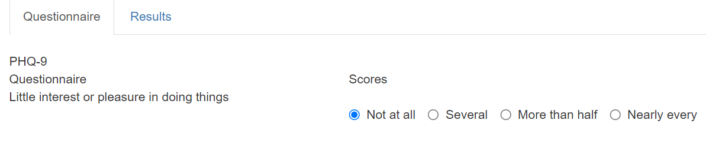
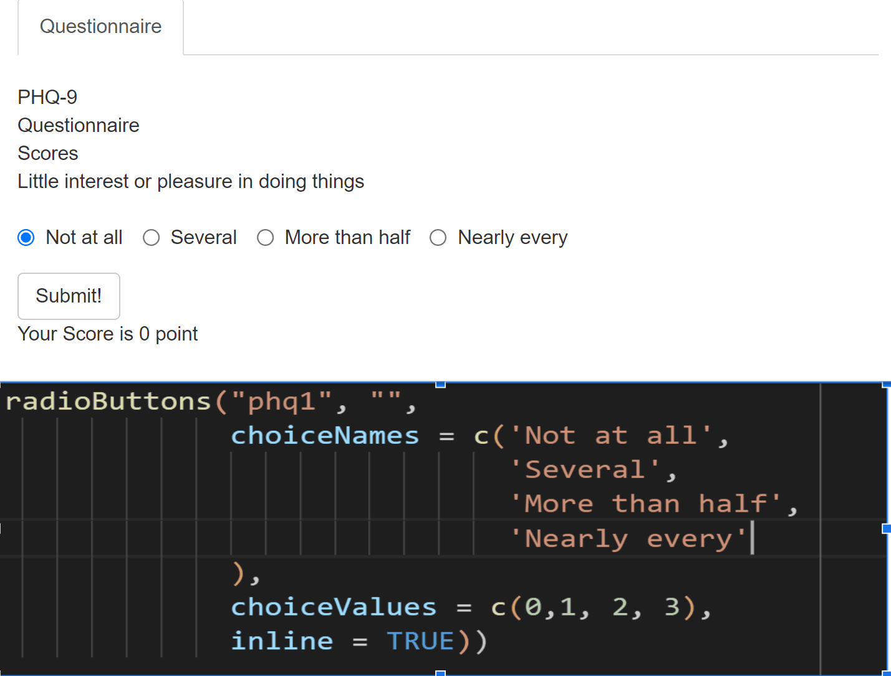
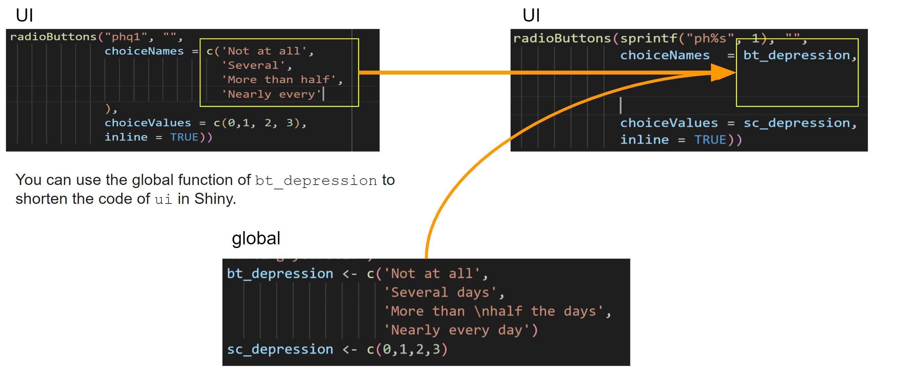
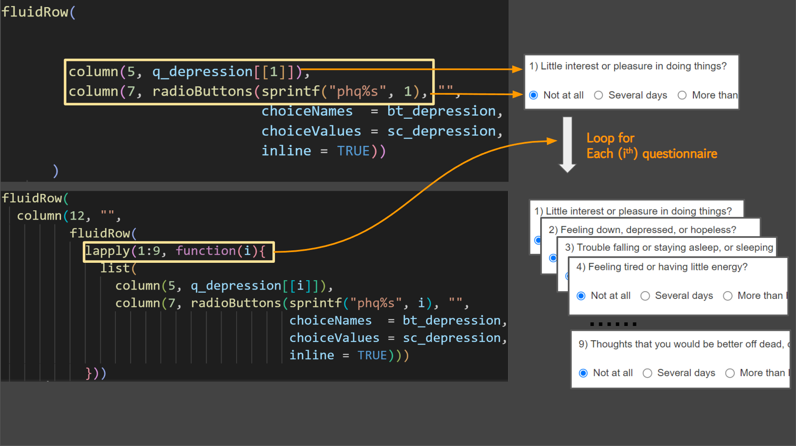

# Shiny for questionnaire input

In this chapter, I will discuss about the PHQ-9 and shiny apps. <br>

> PHQ-9 

The Patient Health Questionnaire-9 (PHQ-9) is a self-report questionnaire used to screen for major depressive disorder (MDD). It is a nine-item questionnaire that asks about symptoms of depression such as depressed mood, loss of interest or pleasure, changes in sleep, changes in appetite, changes in energy, difficulty concentrating, worthlessness or excessive guilt, thoughts of death or suicide, and psychomotor agitation or retardation. The PHQ-9 is scored on a scale of 0 to 27, with higher scores indicating more severe depression. A score of 10 or more is considered to be positive for MDD.

for questionnaire, the url is following. 

https://med.stanford.edu/fastlab/research/imapp/msrs/_jcr_content/main/accordion/accordion_content3/download_256324296/file.res/PHQ9%20id%20date%2008.03.pdf
<br>

  <iframe src="https://med.stanford.edu/fastlab/research/imapp/msrs/_jcr_content/main/accordion/accordion_content3/download_256324296/file.res/PHQ9%20id%20date%2008.03.pdf" width="100%" height="800px" style="border: none;"></iframe>

<br>

> Here are the guidelines for each score on the PHQ-9:


| Score | severity | Guideline |
|---|-----|----------------          |
| 0-4 | Minimal depression | You may have some mild symptoms of depression, but they are not severe enough to interfere with your daily life. |
| 5-9 | Mild depression | You may have some moderate symptoms of depression, and they may be interfering with your daily life to some extent. |
| 10-14 | Moderate depression | You may have some severe symptoms of depression, and they are interfering with your daily life to a significant extent. |
| 15-19 | Moderately severe depression | You may have some very severe symptoms of depression, and they are interfering with your daily life to a great extent. |
| 20-27 | Severe depression | You may have some extremely severe symptoms of depression, and they are interfering with your daily life to a very great extent. |


<br>

> Now, let's creates a fluid page with a single tab panel containing a questionnaire based on the Patient Health Questionnaire-9 (PHQ-9)

<br>




```r
ui = fluidPage(
  tabsetPanel(
    tabPanel("Questionnaire", 
             fluidRow(
               br(),
              column(12, "PHQ-9", 
                     fluidRow(
                     column(5, "Questionnaire"), 
                     column(7, "Scores")
                     ))), 
             fluidRow(
              column(12, "",
               fluidRow(
                       column(5, "Little interest or pleasure in doing things"), 
                       column(7, radioButtons("phq1", "",
                                              choiceNames = c('Not at all',
                                                              'Several',
                                                              'More than half',
                                                              'Nearly every'
                                              ), 
                                              choiceValues = c(0,1, 2, 3),
                                              inline = TRUE))
                     )
              )), 
             actionButton("submit_depression", "Submit!"),
             htmlOutput("depression")
             ) 
  )
)
```



* The radioButtons() function has the following arguments:
  * phq1: The name of the radio button group.
  * label: The label for the radio button group.
  * choiceNames: A vector of strings that contains the names of the options in the radio button group.
  * choiceValues: A vector of numbers that corresponds to the values of the options in the radio button group.
  * inline: A logical value that indicates whether the radio buttons should be displayed inline (TRUE) or in a separate row (FALSE).


When this code is executed, it will create a radio button group with the following options:

|choiceNames|choiceValues|
|---|---|
|Not at all  |(0)|
|Several |(1)|
|More than half |(2)|
|Nearly every |(3)|

The user can select one of these options by clicking on the corresponding radio button. <br>

**The value of the selected option will be stored in the variable phq1.**

The depression_score() reactive function is defined as follows:


```r
depression_score <- reactive({
  phq1 = as.numeric(input$phq1)
  return(sum(phq1))
})
```
This function first converts the value of the phq1 input to a number. It then sums the values of the phq1 input. The result is returned from the function.


```r
server = function(input, output, session){
  
  observeEvent(input$submit_depression, {
    depression_score <- reactive({
      phq1 = as.numeric(input$phq1)
      return(sum(phq1))
    })
    output$depression <- renderText({
      paste("Your Score is", depression_score(), "point")
    })
  })
}
```

The renderText() function is used to render text to the output. In the code you provided, the renderText() function is used to render the text "Your Score is" followed by the value of the depression_score() reactive function. <br>


```r
ui = fluidPage(
  # previous UI code here 
htmlOutput("depression")

)
```


finally for UI again,  the htmlOutput() function is used to create an output that will display the value of the depression reactive function. The value of the depression reactive function is the depression score calculated based on the value of the phq1 input


> Let's make global.R


```r
pkgs = c("shiny", "tidyverse")

for (pkg in pkgs){
  if(!require(pkg, character.only = T)){
    install.packages(pkg)
    library(pkg, character.only = T)
  }
}

q_depression <-list("1) Little interest or pleasure in doing things?",
                    "2) Feeling down, depressed, or hopeless?",  
                    "3) Trouble falling or staying asleep, or sleeping too much?",
                    "4) Feeling tired or having little energy?",
                    "5) Poor appetite or overeating?", 
                    "6) Feeling bad about yourself or that you are a failure or
have let yourself or your family down?",
                    "7) Trouble concentrating on things, such as reading the
newspaper or watching television?",
                    "8) Moving or speaking so slowly that other people could
have noticed. Or the opposite being so figety or
restless that you have been moving around a lot more
than usual?",
                    "9) Thoughts that you would be better off dead, or of
hurting yourself")
bt_depression <- c('Not at all',
                   'Several days',
                   'More than \nhalf the days', 
                   'Nearly every day')
sc_depression <- c(0,1,2,3)
```

<br>

> Now, I will use global, q_depression, bt_depression and sc_depression, to shorten the code of ui in Shiny.

 


```r
ui = fluidPage(
  tabsetPanel(
    tabPanel("Questionnaire", 
             fluidRow(
               br(),
              column(12, "PHQ-9", 
                     fluidRow(
                     column(5, "Questionnaire"), 
                     column(7, "Scores")
                     ))), 
             fluidRow(
              column(12, "",
               fluidRow(
                 
                 
                       column(5, q_depression[[1]]), 
                       column(7, radioButtons(sprintf("phq%s", 1), "",
                                              choiceNames  = bt_depression, 
                                              choiceValues = sc_depression,
                                              inline = TRUE))
                     )
              )), 
             actionButton("submit_depression", "Submit!"),
             htmlOutput("depression")
             ) 
  )
)
```

> make other questionnaires

 

Using lapply() is a good approach to generate repetitive code blocks with slightly different input parameters. It allows you to avoid duplicating code and reduces the chances of introducing errors.

By using lapply(), you can loop over a sequence of integers (in this case, 1 to 9) and create a list of elements that share the same structure, but with different inputs. This makes it much easier to generate a questionnaire with many questions and options, as you only need to specify the question and answer choices once, and then the code takes care of generating the rest.

Additionally, using functions like lapply() can also make your code more modular and easier to maintain, as you can separate the logic for generating the input elements from the overall structure of the Shiny app. This can be especially useful when you need to make changes or add new features to your app.


```r
ui = fluidPage(
  tabsetPanel(
    tabPanel("Questionnaire", 
             fluidRow(
               br(),
               column(12, "PHQ-9", 
                      fluidRow(
                        column(5, "Questionnaire"), 
                        column(7, "Scores")
                      ))), 
             fluidRow(
               column(12, "",
                      fluidRow(
                        lapply(1:9, function(i){
                          list(
                            column(5, q_depression[[i]]), 
                            column(7, radioButtons(sprintf("phq%s", i), "",
                                                   choiceNames  = bt_depression, 
                                                   choiceValues = sc_depression,
                                                   inline = TRUE)))
                        }))
               )), 
             actionButton("submit_depression", "Submit!"),
         
            htmlOutput("depression",  style = "font-size: 20px"),
            htmlOutput("guide_depression",  style = "font-size: 20px")
    ) 
  )
)

```


```r
server = function(input, output, session){
  
  observeEvent(input$submit_depression, {
    depression_score <- reactive({
      do.call(sum, lapply(1:9, function(i){
        ph = paste0("phq", i)
        return(as.numeric(input[[ph]]))
      }))
    })
    output$depression <- renderText({
      paste("Your Score is", depression_score(), "point")
    })
    
    output$guide_depression <- renderText({
      guide_depression(depression_score())
      
    })
  })
}
```


```r
pkgs = c("shiny", "tidyverse")

for (pkg in pkgs){
  if(!require(pkg, character.only = T)){
    install.packages(pkg)
    library(pkg, character.only = T)
  }
}

q_depression <-list("1) Little interest or pleasure in doing things?",
                    "2) Feeling down, depressed, or hopeless?",  
                    "3) Trouble falling or staying asleep, or sleeping too much?",
                    "4) Feeling tired or having little energy?",
                    "5) Poor appetite or overeating?", 
                    "6) Feeling bad about yourself or that you are a failure or have let yourself or your family down?",
                    "7) Trouble concentrating on things, such as reading the newspaper or watching television?",
                    "8) Moving or speaking so slowly that other people could have noticed. Or the opposite being so figety or restless that you have been moving around a lot more than usual",
                    "9) Thoughts that you would be better off dead, or of hurting yourself")
bt_depression <- c('Not at all',
                   'Several days',
                   'More than half the days', 
                   'Nearly every day')
sc_depression <- c(0,1,2,3)


interpre_depression <- data.frame("step" = c(1, 2, 3, 4, 5), 
                                  "severity" = c("Minimal depression", 
                                                 "Mild depression", 
                                                 "Moderate depression", 
                                                 "Moderately severe depression", 
                                                 "Severe depression"
                                                 ), 
                                  "guideline"= c("they are not severe enough to interfere with your daily life", "You may have some moderate symptoms of depression, and they may be interfering with your daily life to some extent.", "You may have some severe symptoms of depression, and they are interfering with your daily life to a significant extent.", "You may have some very severe symptoms of depression, and they are interfering with your daily life to a great extent.", "You may have some extremely severe symptoms of depression, and they are interfering with your daily life to a very great extent.")
                                  ) %>%
  mutate(guideline2 = sprintf("%s!: %s", severity, guideline))

guide_depression = function(i){
  if (i < 5) {
    interpre_depression %>% filter(step ==1) %>% pull(guideline2) %>% as.character()
  } else if (i <10) {
    interpre_depression %>% filter(step ==2) %>% pull(guideline2) %>% as.character()
  } else if (i <15) {
    interpre_depression %>% filter(step ==3) %>% pull(guideline2) %>% as.character()
  } else if (i <20) {
    interpre_depression %>% filter(step ==4) %>% pull(guideline2) %>% as.character()
  } else {
    interpre_depression %>% filter(step ==5) %>% pull(guideline2) %>% as.character()
  }
}

```


